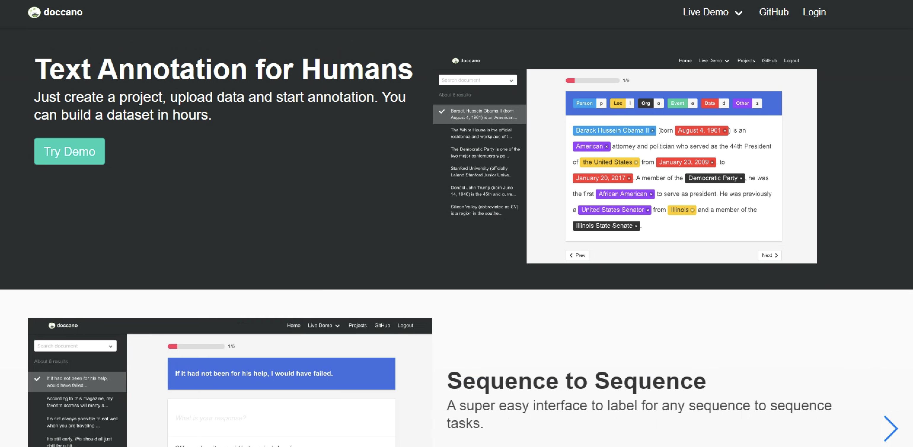

# Doccano

## Hva er produktet?
[Doccano](https://github.com/doccano/doccano) er et open source tekst
annoterings verktøy for mennesker. Hensikten er å forenkle konstruksjonen
av treningsdata, for maskinlærings modeller innenfor NLP.

## Features
- Prosjekt samarbeid
- Prosjektbasert tilgangsstyring
- Brukertilpasset labels og snarveier
- Persistering av tekster
- Støtter dokument klassifisering og sekvens annotering

## Kom i gang
Doccano er egen applikasjon som kjører på NAIS sitt cluster og er tilgjengelig gjennom
[VDI](https://doccano-kubeflow.nais.adeo.no/). Doccano har prosjektbasert tilgangsstyring og det
trengs dermed passord og brukernavn for å opprette et prosjekt. Om du ønsker hjelp til å komme i gang kontakt [#naisflow](https://nav-it.slack.com/archives/CGRMQHT50) på Slack.
Dataplattformen har laget en python pakke [Doccano API](https://github.com/navikt/data-catalog-doccano-api) for å kunne laste opp tekster og laste ned annoterte tekster.

Løsning er ment å bruke sammen med Kubeflow.

1. Sørg for å ha DoccanoApi installert på kubeflow serveren du bruker.
2. Logg inn på [Doccano](https://doccano-kubeflow.nais.adeo.no/) gjennom VDI og opprett et prosjekt eller velg et prosjekt du har tilgang til.

3. Last opp tekster til Doccano ved hjelp av DoccanoApi pakken i Kubeflow. (Se dokumentasjon til DoccanoApi pakken)
4. Annoter tekster.
5. Last ned annoterte tekster ved hjelp av DoccanoApi pakken i Kubeflow.

## Retningslinjer for bruk
Den eneste retningslinjen gjelder ved bruk av tekster som innholder personopplysninger.
Doccano applikasjonen har mulighet til eksportere tekster til lokalt område ved hjelp av "export" knappen, om tekstene
innholder personopplysninger kan dette medføre at personopplsyninger blir flyttet ut av FSS.

## Lenker
- [Doccano repo](https://github.com/doccano/doccano)
- [Doccano applikasjon](https://doccano-kubeflow.nais.adeo.no/)
- [DoccanoApi repo](https://github.com/navikt/data-catalog-doccano-api)
- [DoccanoApi PYPI](https://pypi.org/project/data-catalog-doccano-api/)

