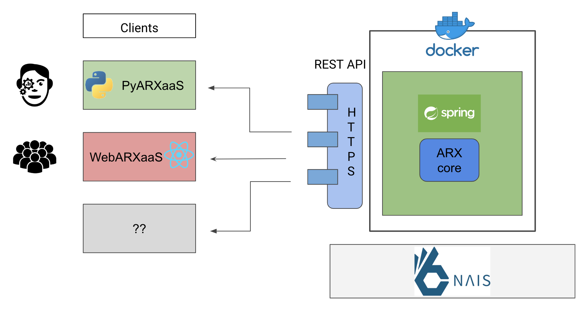

# Anonymisering

## Produkter
### Anonymization as a Service
Anonymization as a Service er resultatet av en bacheloroppgave, og senere et sommerstudentprosjekt, 
gjennomført av bachelorstudenter fra Institutt for informasjonsteknologi ved OsloMet, i samarbeid med NAV IT. 
Prosjektgruppen har utviklet en løsning som forenkler arbeidet med formell anonymisering og tallfesting av 
re-identifiseringsrisiko. Løsningen bygger videre på et etablert anonymiseringsverktøy fra 
[ARX](https://arx.deidentifier.org/) prosjektet, men har gjort verktøyet tilgjengelig for et bredere publikum 
ved å gjøre kjernefunksjonalitet tilgjengelig som en microservice med klienter/programpakker tilpasset for ulike brukergrupper. 
Prosjektet har særlig vektlagt behovene som oppstår i arbeidsprosessen til data scientister i NAV IT, 
og gjør således etablert anonymiseringsmetodikk lettere tilgjengelig i Python og Jupiter Notebooks.
Koden og prosjektrapporten er åpent tilgjengelig under MIT lisens.

- [ARXaas](https://github.com/navikt/ARXaaS)
  Kjernetjenesten. En "Anonymisering microstjeneste" som tilgjengeligjør funskjonalitet for anonymiering som HTTP REST APIer.
- [PyARXaaS](https://github.com/navikt/PyARXaaS)
  Python biblotek for enkel integrasjon med ARXaaS APIene. 
- [WebARX](https://github.com/navikt/webarx-poc)
  En Wepapplikajson som leverer et forenklet GUI for anonymisering til bruker. Applikasjonen utnytter APIene til ARXaaS.

### Hva kan man bruke det til?

### Hvordan komme i gang?

### Kontaktinformasjon

### Link til ROS

### Arkitektur

### Roadmap
Det er for øyeblikket ikke planlagt videreutvikling av AaaS, bortsett fra oppdateringer avhengigheter og andre 
sikkerhets relaterte oppdateringer.

