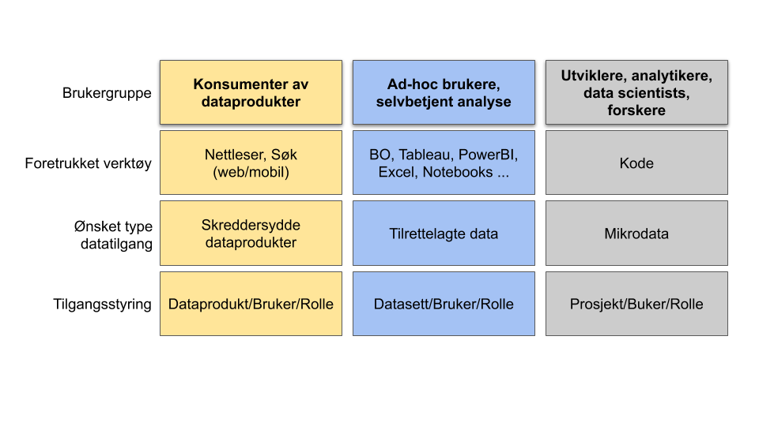
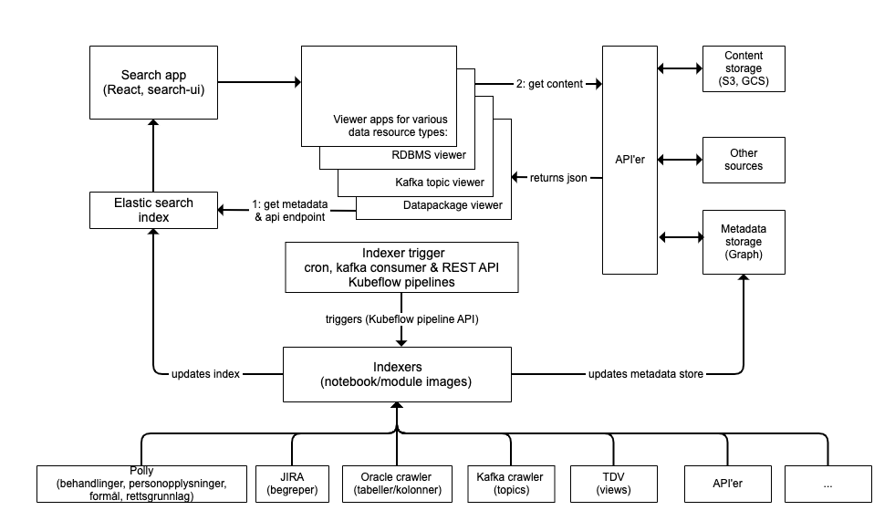
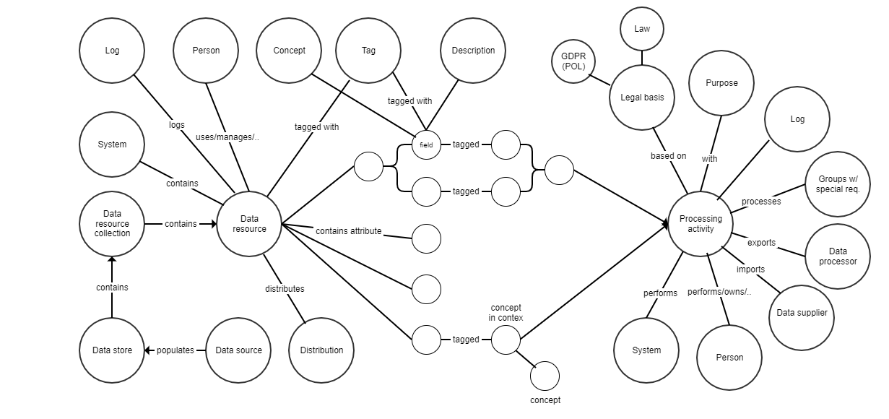

# Datakatalog

## Hva er produktet?

Datakatalogen gir oversikt over og informasjon om data og dataprodukter i NAV. Det er tre ulike innganger til katalogen:

* [Åpne data](https://data.nav.no). Dette er et utsnitt av data og dataprodukter som er offentlig tilgjengelige.

* [Intern datakatalog](https://data.adeo.no). Inneholder i tillegg til offentlig tilgjengelige data og dataprodukter også data og dataprodukter som kun er tilgjengelige internt i NAV

* [Felles datakatalog](https://fellesdatakatalog.digdir.no). Metadata om data og dataprodukter 

Datakatalogen har to hovedformål: 

* Gjøre data fra NAV tilgjengelig for interne og eksterne brukere på en brukervennlig måte. 

* Øke produktivitetet til analytikere og data scientister i NAV. Dette gjør vi ved å berike og indeksere data ressurser (begreper, tabell, strømmer, data visualiseringer og andre dataprodukter) og å gjøre disse lett å finne i et søkegrensesnitt.

## Hvem er dette laget for?

## Hvordan komme i gang?

Som bruker av data: Gå til [søkesiden](https://data.adeo.no)

Som produsent av data:

* Jeg har en database og ønsker at deler av innholdet skal bli tilgjengelig i katalogen: Ta kontakt med #data-catalog-intern på Slack så hjelper vi deg i gang.

* Jeg har en kafka topic og ønsker at den skal skal bli tilgjengelig i katalogen: Ta kontakt med #data-catalog-intern på Slack så finner vi sammen ut av hvordan det kan løses 

* Jeg har et API og ønsker at det skal skal bli tilgjengelig i katalogen: Ta kontakt med #data-catalog-intern på Slack så hjelper vi deg i gang.

* Jeg har ønsker å publisere et datasett eller en datapakke: Ta kontakt med #data-catalog-intern på Slack så hjelper vi deg i gang.

## Kontaktinformasjon

Ta kontakt med [#data-catalog-intern](https://nav-it.slack.com/archives/CQ9SV9DNE) på Slack.

## Litt om arkitektur

Data leses fra kilder (pull) med tjenester som samtidig oppdaterer en søkeindeks (ElasticSearch) og et metadatalager (graf modell). 
Tjenestene som henter og lagrer metadata kan f.eks implementeres i en notebook. Tjenestene kan kjøres automatisk ved gitte tidspunkter i Kubeflow.

Alternativt kan en ekstern tjenste levere data (push) som en strøm, via et REST kall eller på annen måte.

Metadata fra datakatalogen kan presenters i en 'viewer' applikasjon som er skreddersydd for metadata typen. Vi har utviklet viewere for databasetabeller, Kafka topics, begreper, datapakker. Viewer applikasjonene bygger på felleskomponenter for å gjøre det enkelt både å videreutikle disse og å lage nye 'viewere' for nye typer metadata.

Metadata kan også presenteres på andre måter. One-off og ad-hoc visninger kan f.eks. presentere som datapakker. Metadata kan også benyttes som datakilde i andre applikasjoner.

### Overordnet arkitektur

### Domenemodell. Kun ment som illustrasjon. Grafen inneholder også andre typer noder og forbindelser

### Kobling mot andre domener

### Arkitekturbeslutninger

 * [Valg av hovedarkitektur](arkitektur/valg_av_hovedarkitektur.md)
 * [Valg av database](arkitektur/valg_av_database.md)
 * [Pseudonymisering](arkitektur/pseudonymisering.md)

### Applikasjoner

* [Ekstern datakatalog: Beta](https://dataverk.nav.no)
* [Ekstern datakatalog: Test](https://dataverk-q.nav.no)
* [Intern datakatalog: Prod](https://data-search.nais.adeo)
* [Intern datakatalog: Test](https://data-search.nais.preprod.local)

### API'er
  [https://dv-resource-rw-api.nais.adeo.no/dcat](https://dv-resource-rw-api.nais.adeo.no/dcat). Elastic search index for datakatalogen
  
  
### Repoer

* [Søkeside](https://github.com/navikt/data-search). Basert på [Search UI](https://github.com/elastic/search-ui) fra Elastic 
* [API for innohold i katalogen lagret i Cosmos DB](https://github.com/navikt/data-catalog-api). Cosmos DB benyttes som lager for metadata for datakatalogen
* [RDF API](https://github.com/navikt/digdir-api). API som Felles Datakalog bruker for å laste data
* [DCAT AP-NO validator](https://github.com/navikt/data-catalog-dcat-validator). Python pakke for å validere metadata
* [ETL verktøy](https://github.com/navikt/dataverk). Python pakke for kodebasert ETL

#### Mikro frontend viewer applikasjoner for ulike innholdstyper

* [Tabell viewer](https://github.com/navikt/data-catalog-table-viewer). Visning av databasetabeller inkl dataprofilering
* [Kafka viewer](https://github.com/navikt/data-catalog-kafka-topic-viewer). Visning av kafka topics (POC)
* [Begrep viewer](https://github.com/navikt/data-catalog-term-viewer). Visning av begreper
* [Datasett viewer](https://github.com/deetly/datapackage-viewer). Visning av datasett
* [Tableau workbook viewer](https://github.com/navikt/data-catalog-tableau-viewer).  Visning av tableau workbooks (POC)

#### Utils
* [Designsystem komponenter](https://github.com/navikt/data-catalog-components). Felleskomponenter basert på [Base Web](https://baseweb.design). [Storybook](https://navikt.github.io/data-catalog-components/?path=/story/design-system-intro--page)
* [Viewer template](https://github.com/navikt/data-catalog-api-viewer). Template for utvikling av nye viewer applikasjoner
* [Theming](https://github.com/navikt/dataverk-tools). Python bibliotek for NAV theming av grafiske fremstillinger av data.
* [Tekster (markdown](https://github.com/navikt/data-catalog-markdown). 'About' tekster som brukes i viewer applikasjonene.

#### Indeksering av data
  
* [Python script for å hente, laste og indeksere data](https://github.com/navikt/data-catalog-indexers). Skedulerte skript for å hente data fra ulike kilder, laste til graf databasen og indeksere i Elastic Search

* [API Proxy](https://github.com/navikt/dataverk-proxy)

### Utvikling
* [Trello](https://trello.com/b/kd4dRGH9/data-catalog)
* [Brukerhistorier](stories.md)
* [Møtereferater](https://github.com/navikt/data-catalog-notes)

