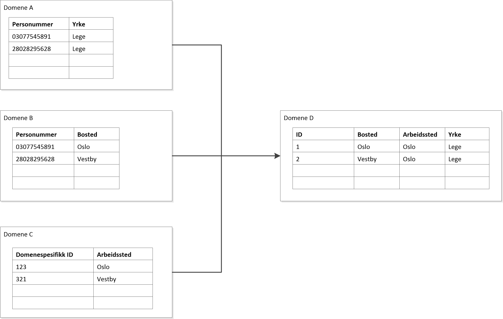

# Pseudonymisering for å beskytte PII i forbindelse med analyse, rapportering og statistikk produksjon på tvers av domener

## Status

Mange systemer bruker personummer som nøkkel for personrelatert informasjon. Andre systemer bruker systemspesifikke eller tverrgående pseudonøkkler. Eksempelvis fk_x i datavarehuset.

## Kontekst

I arbeid med analyse, rapportering og statistikk produksjon så ønsker vi at analytikere skal være så selvhjulpne som mulig, og ikke være avhengig av tredjeparter for å kunne utføre sine analyser. Når data må sammenstilles på tvers av domener er det behov for en felles koblingsnøkkel eller en annen form for mekanisme som gjør det mulig å koble data på tvers av nøkler/domener. Hvis datasettene inneholder informasjon om personer, så er det naturlig å benytte personnummer/personident som koblingsnøkkel. 

Koblingnøkkelen i seg selv er ikke nyttig for analytikerne etter at koblingen er utført. Et personvernfremmende tiltak kan derfor være å innføre hashing av personidenter under kobling av datakilder. Denne teksten presenterer flere alternativer som adresserer denne utfordringen.

## Løsningsalternativer

### 1) Pseudonymisering ved import/load

"Import" i denne konteksten er når data hentes ut av et fagsystem og/eller datavarehus og inn i det analytiske verktøyet som analysen skal utføres i.

Eksempel på uttrekk fra datakilde som ikke har pseudonøkler i datasettet:

select hash(a.personummer), a.yrke, b.bosted, c.arbeidssted 
from a.tabell a
join personummer, bosted from b.tabell on a.personummer = b.personummer
join select personummer, arbeidssted from 
(select k.personummer, c.arbeidsted 
from c.tabell
join c.koblingstabell on c.id = k.id)
) as c on a.personummer = c.personummer

Fordeler:

* Lite ressurskrevende: NAV behøver ikke å utvikle en ny, felles tilnærming for å hashe PII som fungerer på tvers av alle domener.

#### Ulemper:

* Analytiker må få tilgang til rådata i datakilden, og vil ha tilgang til ukrypterte personidenter. Analytikeren vil ha ansvar for å selv hashe personidenter når uttrekket gjøres (som i eksemplet over). 

* I tillegg vil analytiker også ha tilgang til selve hashing-funksjonen og kan dermed finne ut hvilken hashverdi som er knyttet til et kjent personnummer

* Kilder som idag bruker pseudonøkler internt, eksempelvis datavarehuset, må eksponere personummer uhashet for at analytiker skal kunne gjøre koblinger på denne måten.

### 2) Pseudonymisering i domenet / ved eksport

Dette løsningsforslaget forutsetter at hvert domene tilbyr å hente ut data ferdig hashet. For å realisere dette må hvert domene enten implementere logikk for å tilby dette, eller ta i bruk felleskomponenter som gjør dette der det er mulig.

Eksempel 

select a.id, a.yrke, b.bosted, c.arbeidssted 
from a.tabell as a
join id, bosted from b.tabell on a.id = b.id as b
join arbeidssted from c.tabell on a.id = c.id as c

#### Fordeler:

* Enkelt for en analytiker å koble data på tvers av domener, da data er hashet på en konsekvent måte
* Sterkere personvern da personummer ikke tilgjengelig for analytikere

#### Ulemper:

* Alle domener må bruke den samme hashing/pseudonymisering funksjonen/tilnærmingen. Dersom hashe-funksjonen blir kompromittert i ett domene, så er alle domener kompromittert.
* Ressurskrevende: Alle domener må levere 'data on the outside' i pseudonymisert format. Dette vil både kreve koordinering og oppfølging på tvers. Mange domener/team kan antas å ikke ha budsjett/handlingsrom for å prioritere dette.

### 3) Eget miljø for analyse/rapportering/statistikk med pseudonymiserte kopier av data

Data gjøres tilgjengelig i et datavarehus/datalake

#### Fordeler:

* Enkelt å koble data på tvers av domener
* Personummer ikke tilgjengelig for analytikere

#### Ulemper:

* Ressurskrevende

### 4) Eget analysesystem der alle variabler er tilgjengelige kombinert med databearbeidingsfunkjonalitet som sikrer konfidensialitet

Ref. microdata.no

#### Fordeler:

* Innebygget strekt personvern 
* Brukevennlig for analytikere

#### Ulemper:

* Ressurskrevende å implementere

### 5) Spørringer mot databaser og andre datakilder går gjennom en komponent (dataverk) som automatisk pseudonymiserer alle personnummer/personidenter

Datasett med PII blir kun tilgjengelig for analytikere gjennom dataverk. Autentisering mot datakilder utføres av dataverk med en systembruker med passord lagret i Vault. Dataverk transformerer resultatsettet til en dataframe. Dataverk identifiserer automatisk kolonner som innholder personnummer (med https://github.com/microsoft/presidio e.l) og hasher verdiene i disse kolonnene før datasettet returneres.   

#### Fordeler:

* Analytiker har ingen tilgang til personummer 
* Brukevennlig for analytikere
* Enkelt å sku av og på ytterligere beskyttelse av andre former for PII (epost, telefonnummer, navn osv)
* Kan håndtere alle typer datakilder & databaser

#### Ulemper:

* Ressurskrevende runtime da hele datasett må lastes før join. Fordrer distribuert prosessesering med Dask e.l.
* Krever noe utvikling om dataverk skal autentisere brukere og logge spørringer.

### 6. Datavirtualisering (TDV)

TODO: Manger beskrivelse

## Beslutning

Alternativ 1 ble valgt som kortsiktig løsning.
Alternativ 2 - 6 vurderes videre.

## Konsekvenser

Avgivende systemer og databaser må tillate bruk av personummer som koblingsnøkkel.
Analytikere blir ansvarlige for pseudonymisering.
