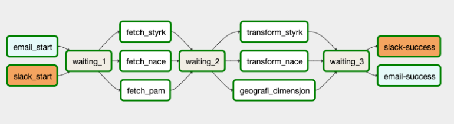

[Apache Airflow](https://airflow.apache.org/docs/apache-airflow/stable/index.html) er et verktøy for å orkestrere,
skedulere og monitorere datapipelines. Web-grensesnittet til Airflow gir brukeren enkel tilgang til å lese logger fra
de ulike stegene i pipelinen, trigge datapipelines manuelt og sjekke statistikk på tidligere kjøringer.

En datapipeline i Airflow, eller DAG (Directed Acyclic Graph), er et sett med oppgaver man ønsker å kjøre som beskriver
rekkefølge og avhengigheter mellom oppgavene. Disse DAG-ene beskrives programmatisk i python filer og legges i et Github
repo som periodisk synkroniseres med Airflow instansen. Nedenfor ser du en en grafisk representasjon av flyten i en DAG:

NADA tilbyr team eller enkeltpersoner å sette opp airflow instanser i sine egne k8s namespacer via [knorten](https://knorten.knada.io).

For mer informasjon om Airflow, se [Airflow docs](https://airflow.apache.org/docs/apache-airflow/stable/index.html)

### Oppsett av repo for DAGs
For å bruke Knada airflow kreves det at det lages et github repo under `navikt` organisasjonen på Github som inneholder Python-filer med DAGer. 

En gang i minuttet vil DAGene som ligger i repoet bli synkronisert til Airflow instansen.

#### Eksempler på DAGs repoer
- [opendata-dags](https://github.com/navikt/opendata-dags) inneholder eksempler på DAGs.
- [sykefravar-dags](https://github.com/navikt/sykefravar-dags) inneholder en rekke eksempler på hvordan å ta i bruk ulike operators i Airflow.

## Dataverk-Airflow
[Dataverk-Airflow](https://github.com/navikt/dataverk-airflow) er et wrapperbibliotek som gjør det enklere å
bruke [KubernetesPodOperator](https://airflow.apache.org/docs/apache-airflow/stable/kubernetes.html) i KNADA clusteret.

Biblioteket inneholder wrapper-funksjoner for å kjøre Jupyter notebookso og Python scripts i separate Kubernetes podder. Se [README](https://github.com/navikt/dataverk-airflow/blob/master/README.md)
på repoet for eksempler.
