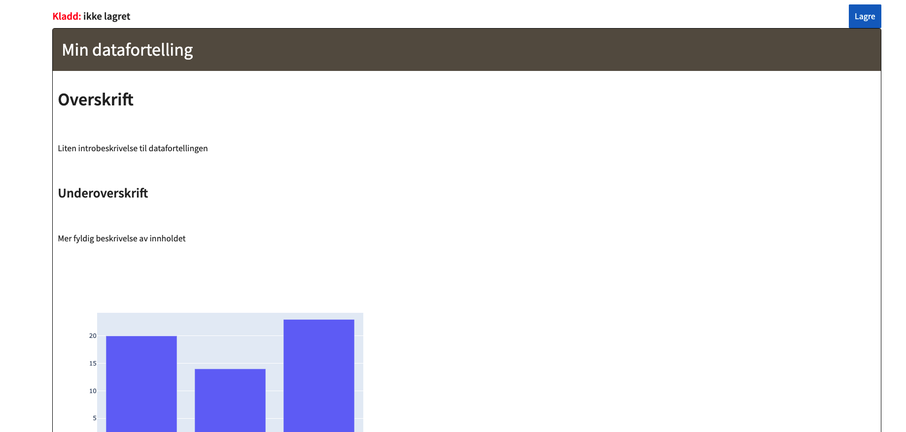

Datafortellinger brukes til å dele innsikt i form av statiske dokumenter.
Datafortellinger kan kan enkelt deles med andre i NAV gjennom Markedsplassen.

## Installere Quarto

### Lokal maskin
Følge installasjonsoppskriften på [quarto.org/docs](https://quarto.org/docs/get-started/).
Husk å hold Quarto oppdatert.

### KNADA VM
Vi anbefaler å følge guiden [Tarball Installation On Linux](https://quarto.org/docs/download/tarball.html).
Igjen må man selv huske å holde Quarto oppdatert.

### Docker image
Vi anbefaler å bruke kommandoen nedenfor i din `Dockerfile` for å installere Quarto.
Denne vil hente ned siste versjon av Quarto hver gang Docker-imaget blir bygd.

```
# jq, wget, og tar må være installert for at kommandoen nedenfor skal fungere
RUN cd /app && \
    QUARTO_VERSION=$(curl https://api.github.com/repos/quarto-dev/quarto-cli/releases/latest | jq '.tag_name' | sed -e 's/[\"v]//g') && \
    wget https://github.com/quarto-dev/quarto-cli/releases/download/v${QUARTO_VERSION}/quarto-${QUARTO_VERSION}-linux-amd64.tar.gz && \
    tar -zxvf quarto-${QUARTO_VERSION}-linux-amd64.tar.gz && \
    mv /app/quarto-${QUARTO_VERSION} /app/quarto
ENV PATH="${PATH}:/app/quarto/bin"
```

## Lage Quarto
Se [Get Started](https://quarto.org/docs/get-started/) på Quarto sine sider.

## Oppdater eksisterende Quarto
For å oppdatere en eksisterende Quarto fortelling må man først generere ressursfilene på nytt med `quarto render <file>`.

Deretter må man hente ut ID for Quartoen man ønsker å oppdatere og team-tokenet fra [markedsplassen](https://data.intern.nav.no).

I eksemplene under må følgende byttes ut med reelle verdier:

- `${ENV}` 
    - For `knada` VMer og jupyter notebooks/airflow i `knada-clusteret` settes dette til *datamarkedsplassen.intern.dev.nav.no* for dev og *datamarkedsplassen.intern.nav.no* for prod
    - Ellers settes det til *data.ekstern.dev.nav.no* for dev og *data.nav.no* for prod
- `${QUARTO_ID}` - erstatt med ID på Quarto
- `${TEAM_TOKEN}` - erstatt med team-token fra markedsplassen

Eksemplene tar utgangspunkt i at det er filen `index.html` som skal lastes opp og at man kjører kommandoene fra samme mappe som filen ligger.

### Med curl

```bash
curl -X PUT -F index.html=@index.html \
    "https://${ENV}/quarto/update/${QUARTO_ID}" \
    -H "Authorization:Bearer ${TEAM_TOKEN}"
```

#### Flere filer

```bash
#!/bin/bash
set -e

FILES=""
for file in <mappe med filene>/*
do
  FILES+=" -F $file=@$file"
done

curl -X PUT $FILES "https://${ENV}/quarto/update/${QUARTO_ID}" \
    -H "Authorization:Bearer ${TEAM_TOKEN}"
```

### Med python

```python
import os
import requests

# A list of file paths to be uploaded
files_to_upload = [
    "PATH/index.html"
    "PATH/SUB/FOLDER/some.html"
]

multipart_form_data = {}
for file_path in files_to_upload:
    file_name = os.path.basename(file_path)
    with open(file_path, 'rb') as file:
        # Read the file contents and store them in the dictionary
        file_contents = file.read()
        multipart_form_data[file_path] = (file_name, file_contents)

# Send the request with all files in the dictionary
response = requests.put( f"https://{ENV}/quarto/update/{QUARTO_ID}", 
                        headers={"Authorization": f"Bearer {TEAM_TOKEN}"},
                        files=multipart_form_data)
    
print(response.status_code)
```

### Oppdatere Quarto med Naisjob

For å produksjonsette oppdatering av en Quarto Datafortelling med Naisjob er det noe konfigurasjon man må spesifisere i NAIS manifestet og Dockerfilen til jobben.

- `quarto render` resulterer i at det genereres noen filer som må lagres midlertidig i containermiljøet før publisering til Markedsplassen. Man er derfor nødt til å legge til annotasjon i Naisjob manifestet for å tillate skriving til filsystemet i containeren
````yaml
metadata:
  annotations:
    nais.io/read-only-file-system: "false"
````
- All utgående trafikk fra Naisjobben vil by default stoppes, så man må legge til en outbound access policy til Markedsplass hosten man skal publisere til (dev/prod)
````yaml
spec:
  accessPolicy:
    outbound:
      external:
        - host: data.ekstern.dev.nav.no # for dev
        - host: data.nav.no # for prod
````
- I Dockerfilen må man lage en bruker med userid 1069 å velge denne brukeren
````Dockerfile
RUN groupadd -g 1069 python && \
    useradd -r -u 1069 -g python python

USER python
````

Repoet [navikt/nada-quarto](https://github.com/navikt/nada-quarto) har et fullstendig eksempel nødvendig oppsett, se spesielt

- [Naisjob manifest](https://github.com/navikt/nada-quarto/blob/main/naisjob.yaml)
- [Dockerfile](https://github.com/navikt/nada-quarto/blob/main/Dockerfile)
- [Publiseringsskript](https://github.com/navikt/nada-quarto/blob/main/publish.sh)
- [Nødvendige python biblioteker som må installeres](https://github.com/navikt/nada-quarto/blob/main/requirements.txt)

I eksempelet hentes team-tokenet fra en [kubernetes secret](https://kubernetes.io/docs/concepts/configuration/secret/) i clusteret og settes som miljøvariabelen `NADA_TOKEN`.

#### Andre eksempler med Naisjob
- [fia](https://github.com/navikt/fia-datafortelling): Mer avansert eksempel med produksjonssatt datafortelling

## Quarto book
Vi har en enkel rigg for å publisere [Quarto fortelling](https://quarto.org/docs/books/) internt i NAV på `data.intern.nav.no` og eksternt på `data.nav.no`.
Dette oppsettet forutsetter at man oppretter et Github repo med en Github Action som laster opp Quarto booken din til en GCP-bucket eid av deg.
Under følger en oppskrift på hvordan dette kan settes opp:

!!! info "Oppskriften forutsetter at du har tilgang til [navikt organisasjonen](https://github.com/navikt) på Github og tilgang til et GCP prosjekt hvor [storage bucketen](https://cloud.google.com/storage/docs/creating-buckets) skal opprettes. I tillegg kreves kunnskap om hvordan å dytte kode til et Github repo"


1. Opprett et repo under [navikt-organisasjonen](https://github.com/organizations/navikt/repositories/new) på Github.
2. Opprett en [storage bucket](https://cloud.google.com/storage/docs/creating-buckets) i et GCP prosjekt du er medlem av.
3. Lag Quarto fortellingen din:
    - Anbefaler å bruke Quarto sin egen [dokumentasjon](https://quarto.org/docs/books/) for dette.
    - Eksempler på datafortellinger laget med Quarto i NAV:
        - [Omverdensanalysen](https://github.com/navikt/oma_2023)
        - [Overgangsindikator](https://github.com/navikt/ovind_docs)
        - [tada](https://github.com/navikt/tada-playbook)
4. Opprett en service account i GCP prosjektet:
    - For å opprette service account, se dokumentasjon i [cloud.google.com](https://cloud.google.com/iam/docs/service-accounts-create).
    - Gi service accounten rollen `Storage Admin` på bucketen opprettet i (2).
      Se dokumentasjon i [cloud.google.com](https://cloud.google.com/storage/docs/access-control/using-iam-permissions).
5. Lag en [JSON nøkkel](https://cloud.google.com/iam/docs/keys-create-delete) for service accounten.
   Denne lagrer du midlertidig lokalt på maskinen din.
6. Opprett en en [Github Action secret](https://docs.github.com/en/actions/security-guides/using-secrets-in-github-actions) i repoet ditt du kaller `GCP_CREDENTIALS`.
   Innholdet i secreten er JSON nøkkelen fra (5). Etter at secreten er lagt til i repoet bør JSON-nøkkelen fjernes fra maskinen din.
7. Når du har laget datafortellingen din med Quarto og dyttet denne til repoet opprettet i (1) kan du sette opp en Github Action som laster fortellingen din til bucketen på GCP hver gang du pusher kode til repoet.
   Opprett filen `.github/workflows/update-quarto.yaml` i repoet med følgende innhold:

!!! info "I eksempelet under må ${BUCKET} erstattes med navnet på bucketen du lagde i (2). ${NAME} må erstattes med et selvvalgt navn som representerer quarto storien."

```yaml
name: update-quarto
on: 
  push:
    branches:
      - 'main'

jobs:
  update-quarto:
    name: Update quarto story
    runs-on: latest
    steps:
      - uses: actions/checkout@v4
      - id: 'auth'
        uses: 'google-github-actions/auth@v1'
        with:
          credentials_json: '${{ secrets.GCP_CREDENTIALS }}'
      - name: 'Set up Cloud SDK'
        uses: 'google-github-actions/setup-gcloud@v1'
      - name: Upload files
        working-directory: _site
        run: gsutil cp -r * gs://${BUCKET}/${NAME}/
```

8. Lag en pull request til [navikt/nada-quarto-proxy](https://github.com/navikt/nada-quarto-proxy).
   Pull requesten må inneholde følgende:
    - Opprett filen `.nais/${NAME}.yaml` med innholdet nedenfor.
    - Legg til `,.nais/${NAME}.yaml` på slutten av linjen på felles [workflow](https://github.com/navikt/nada-quarto-proxy/blob/main/.github/workflows/build-and-deploy.yaml#L34).

!!! info "Erstatt ${BUCKET} med navn på bucket fra (2) og ${NAME} med det du valgte i (7)"

```yaml
kind: "Application"
apiVersion: "nais.io/v1alpha1"
metadata:
  name: quarto-${NAME}
  namespace: nada
  labels:
    team: nada
spec:
  image: {{ image }}
  env:
    - name: GCS_QUARTO_BUCKET
      value: ${BUCKET}
    - name: QUARTO_UUID
      value: ${NAME}
    - name: QUARTO_PATH
      value: ${NAME}
  ingresses:
    - https://data.intern.nav.no/${NAME}
  replicas:
    min: 1
    max: 2
```

9. Man må også gi Nais-appen som blir opprettet i navikt/nada-quarto-proxy lesetilgang til den samme bucketen.
   Etter at appen har blitt deployet må noen manuelt inn i clustert for å finne ut hvilken service account som har blitt opprettet.
   Denne service accounten må da få rollen `Storage Object Viewer` på bucketen opprettet i (2).

## Datastory
!!!warning "Datafortellinger laget med datastory-biblioteket vil fases ut. Eksisterende datafortellinger vil leve videre en stund, og vi har stengt muligheten for å lage nye."

### Installer datastory bibliotek
````bash
pip install datastory
````

### API adresser
For å publisere en datafortelling må man angi api adressen det skal publiseres til.

- for [dev-miljøet](https://data.dev.intern.nav.no)
    - fra `knada` VMer samt jupyter notebooks/airflow i `knada` clusteret er adressen `https://datamarkedsplassen.intern.dev.nav.no/api`
    - ellers er adressen `https://data.ekstern.dev.nav.no/api`
- for [prod-miljøet](https://data.intern.nav.no) 
    - fra `knada` VMer samt jupyter notebooks/airflow i `knada` clusteret er adressen `https://datamarkedsplassen.intern.nav.no/api`
    - ellers er adressen `https://data.nav.no/api`

I kodeeksemplene som følger brukes dev adressen.

### Lage utkast til datafortelling
````python
from datastory import DataStory

ds = DataStory("Min datafortelling")

ds.header("Overskrift")
ds.markdown("Liten introbeskrivelse til datafortellingen")
ds.header("Underoverskrift", level=2)
ds.markdown("Mer fyldig beskrivelse av innholdet")
ds.header("Figur 1 tittel", level=3)
ds.plotly(fig_plotly.to_json())
ds.markdown("Beskrivelse av figur 1")
ds.header("Figur 2 tittel", level=3)
ds.vega(fig_vega)
ds.markdown("Beskrivelse av figur 2")

ds.publish(url="https://data.ekstern.dev.nav.no/api")
````

Når man kaller `ds.publish()` i eksempelet over vil det bli opprettet en kladd til en datafortelling, se [her](#publisere-datafortelling) 
for å se hvordan man publiserer en datafortelling fra en kladd.

### Publisere datafortelling
Publisering av en datafortelling gjøres fra kladd-visningen i datamarkedsplassen som følger:

1. Logg inn
2. Trykk lagre

3. Velg hvilket av dine team som skal eie datafortellingen
4. Velg om du skal lage en ny eller overskrive en eksisterende datastory

### Programmatisk oppdatere eksisterende datafortelling
For å oppdatere en publisert datafortelling programmatisk må man autentisere seg med et token. 
Dette tokenet blir generert når man publiserer en kladd og kan hentes ut ved å gå til den publiserte datafortellingen og fra [kebab menyen](https://uxplanet.org/choose-correct-menu-icon-for-your-navigation-7ffc22df80ac#160b) velge `vis token`.
Når du har fått hentet ut oppdateringstokenet kan du erstatte siste kodelinje i eksempelet over (dvs. `ds.publish()`) med en metode som i stedet oppdaterer datafortellingen.

````python
ds.update(token="mitt-token", url="https://datamarkedsplassen.intern.dev.nav.no/api")
````

Dersom man ønsker å unngå å sette api adressen til Markedsplassen som input parameter til `ds.publish()` og `ds.update()` metodene kan man i stedet sette det som miljøvariabel, f.eks.
````python
import os
os.environ["DATASTORY_URL"] = "https://datamarkedsplassen.intern.dev.nav.no/api"
````
