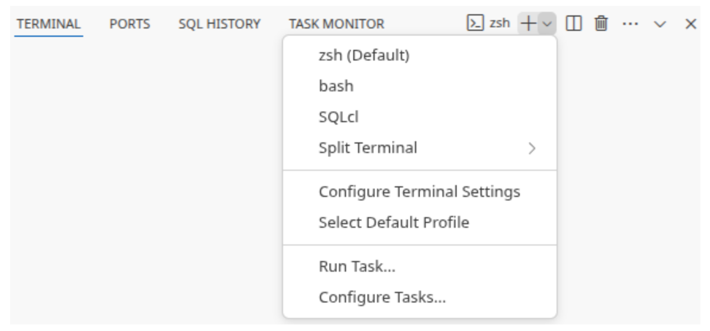

!!! info "For å nå din Knast må du ha naisdevice."

For å opprette en personlig Knast åpner du [Datamarkedsplassen](https://data.ansatt.nav.no/), logger inn og går til "Min Knast" i hamburgermenyen. Der vil du få opp en dialog som tar deg gjennom oppsettet første gang. Alle valg kan endres også etter at Knasten er opprettet.

## Dette må du velge
### Maskintype
Du vet best hvor stor maskin du trenger. Husk at store maskiner er dyrere i drift. Så hvis du er usikker er det lurt å starte smått.
### Utviklingsmiljø
Hvilken IDE vil du jobbe i? Nada tilbyr noen standardimages, men det er mulig å lage custom images i https://github.com/navikt/knast-images.
### Onprem-kilder (valgfritt)
Hvilke onprem-kilder har du behov for å snakke med? Her kan du også velge nais-ingresser som "intern.nav.no", hvis du skal åpne mot f.eks https://teamkatalogen.intern.nav.no
### Internett-URLer (valgfritt)
Her legger du til URL-stier som du trenger å snakke med på internett. Det er god praksis å åpne for minst mulig, for eksempel er `github.com/navikt/*`  bedre enn `github.com/*`.  [Les mer om syntax her](https://cloud.google.com/secure-web-proxy/docs/url-list-syntax-reference).
### Sentralt administrerte åpninger
Nada vedlikeholder en liste med åpninger mot internett som vi anbefaler alle å ha. Ønsker du ingen eller bare noen fra den lista kan du velge skru av og velge alle åpninger selv.

## Første gang du bruker din Knast
### Start Knast
Når du har trykket på "Start opprettelse av Knast" og ventet i noen minutter får du muligheten til å starte Knasten din. Det tar et par minutter å starte Knasten. Når den er klar får du en lenke som du kan åpne for å jobbe i nettleseren din. Du kan også koble til remote fra lokal VS Code ved å trykke på "Bruk Knast via VS Code lokalt" og følge oppskriften der.

!!! info "Knast i nettleser nytes best hvis man installerer den som en [PWA](https://developer.mozilla.org/en-US/docs/Web/Progressive_web_apps/Guides/What_is_a_progressive_web_app). Da vil den i større grad oppføre seg som en vanlig applikasjon og blant annet keybindings vil fungere bedre. [Kjør Knast som en PWA](./kom-i-gang.md#kjr-knast-som-en-pwa)"

### Følgende må gjøres på lokal maskin for å koble VS Code til Knast:

*Hopp over steg 4-6 hvis du har gjort disse tidligere.*

1. **Installere extension Remote - SSH i VS Code**
2. **Logg inn i Google Cloud** (kjøres lokalt) <br> 
`gcloud auth login`
3. **Opprette SSH-tunnel** (kjøres lokalt) <br>
```gcloud workstations start-tcp-tunnel --cluster=knada --config=DIN_NAV_IDENT --region=europe-north1 --project knada-gcp --local-host-port=:33649 DIN_NAV_IDENT 22``` <br>
Husk å sette inn Nav-identen din der det står `DIN_NAV_IDENT`. Porten 33649 er tilfeldig valgt og kan byttes med en annen port om du ønsker det.
4. **Opprette SSH-nøkkel** (kjøres lokalt, hopp over om du allerede har gjort dette) <br>
Sett et passord på SSH-nøkkelen. Du vil aldri bli bedt om å bytte dette. <br>
`ssh-keygen -t ed25519 -C "din_epost_email@nav.no"`
5. **Få Knast til å stole på din SSH-nøkkel** (kjøres på Knast, hopp over om du allerede har gjort dette)
    - Opprette directory **~/.ssh/** hvis det ikke allerede finnes
    - Opprett filen authorized_keys i **~/.ssh/**
    - Lime inn innholdet fra public-delen av SSH-nøkkelen fra **.ssh/id_ed25519.pub** eller tilsvarende på lokal maskin inn i **authorized_keys** på Knast
6. **Legg til knast i ssh-configen** (kjøres lokalt, hopp over om du allerede har gjort dette) <br> `echo -e "\nHost knast\n\tHostName localhost\n\tPort 33649\n\tUser user">>~/.ssh/config` <br>
Hvis valgte en annen port i steg 3 må du velge den her også.
7. **Koble til knast**
    - Åpne Command Palette i VS Code (⇧⌘P / Ctrl+Shift+P)
    - Velg/Skriv inn: Remote - SSH: Connect to host...
    - Skriv inn: knast

Dette er også beskrevet med skjermbilder i [dokumentasjonen til Google Workstations](https://cloud.google.com/workstations/docs/develop-code-using-local-vscode-editor).

### Kjør Knast som en PWA

Når man installerer Knast som en PWA vil Knast oppleves mer som en vanlig applikajson, og kan gi en mye bedre brukeropplevelse. Her er guider til hvordan man kan installere en PWA for noen av de mest brukte nettleserne.

- [Generell guide](https://developer.mozilla.org/en-US/docs/Web/Progressive_web_apps/Guides/Installing)
- [Chrome](https://support.google.com/chrome/answer/9658361?hl=en-GY&ref_topic=7439636&co=GENIE.Platform%3DDesktop)
- [Safari](https://support.apple.com/no-no/guide/safari/ibrw9e991864/18.0/mac/15.0)
- [Vivaldi](https://help.vivaldi.com/desktop/miscellaneous/progressive-web-apps/)
- [Edge](https://learn.microsoft.com/en-us/microsoft-edge/progressive-web-apps/ux)
- [Firefox støtter installasjon av PWA bare gjennom extension](https://github.com/filips123/PWAsForFirefox)

### Bytte shell i terminal

I Knast kan man bytte standard shell i terminalen ved å åpne Command Palette (⇧⌘P / Ctrl+Shift+P) og skrive `Terminal: Select Default Profile`.

Man kan også gjøre dette fra dropdown ved siden av ny terminal-knappen:


Les mer om [Terminal Profiles](https://code.visualstudio.com/docs/terminal/profiles) i Visual Studio Code sin dokumentasjon.

### Python
For å kjøre pythonkode bør du installere en egen pythonversjon. [Les hvordan det gjøres best med uv](./miljo.md#python-med-uv).

### Extensions

For at VSCode skal fungere godt må du installere noen extensions. Om du bruker VSCode i nettleser kjører du egentlig [open source versjonen](https://cloud.google.com/workstations/docs/base-editor-overview) som kalles Code - OSS. Den største forskjellen mellom disse to er at Code - OSS ikke støtter alle extensions som VSCode gjør. Om du derimot kobler til remote fra din lokale VSCode vil du kunne bruke alle extensions. Merk at mange extensions trenger å snakke med internett. Så hvis du opplever problemer med noen av dem bør du følge med på "blokkerte URLer" på [Min Knast](https://data.ansatt.nav.no/user/workstation). [Les mer om nettverk her](./nettverk.md).
### Sudo-rettigheter

Det er begrenset hvilke kommandoer man har lov til å kjøre som sudo. Du kan se hvilke du har lov til å kjøre ved å kjøre `sudo -l`. Hver gang man kjører sudo vil man bli bedt om å skrive inn en bekreftelseskode. Dette bekreftelseskoden er `husk ROS` og brukes utelukkende for å bekrefte at man ønsker å kjøre sudo. Dette gjøres for å unngå at script kjører sudo uten at man vet om det.
### Generelle råd
Andre ting verdt å tenke på er nbstripout, dependabot og autentisering mot github og gcp. Her gjelder det samme som i [Generelle råd for Jupyterhub](../notebook/generelt.md).

### Oppsett av union

Union configen blir automatisk satt opp for Knast miljøet. Knast miljøet vil også komme preinstalleret med seneste versjon av kommandolinjeverktøyet `uctl` for å snakke med Union kontrollplanet.

## Krav til allowlistede hoster for Knast
Følgende standardåpninger er by default allowlistet for Knast maskiner. Disse er nødvendig for å snakke med Union kontrollplanet.

```bash
nav.eu-central-1.unionai.cloud/*
signin.hosted.unionai.cloud/*
storage.googleapis.com/opta-gcp-union-europe-north1-nav-fast-registration/*
```

For å kunne bygge docker imager når nye workflows og tasks skal lastes opp må man også åpne for følgende:

```bash
registry-1.docker.io/*
europe-north1-docker.pkg.dev/*
auth.docker.io/*
```
