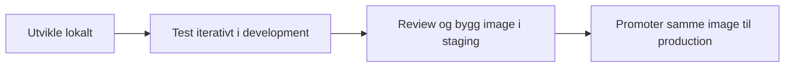
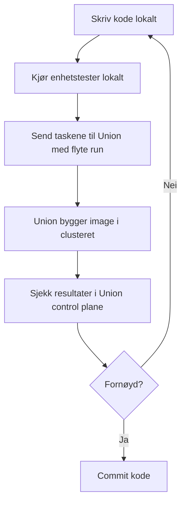
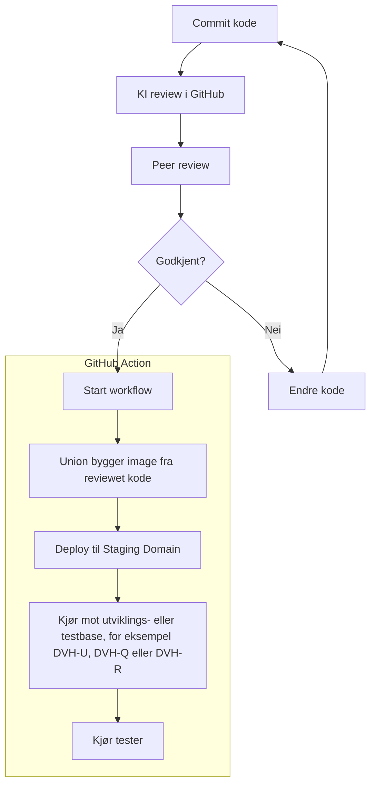
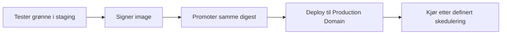

# God praksis for utvikling og deploy i Union

Denne siden beskriver en anbefalt arbeidsflyt for utvikling, test og deploy av workflows i Union.

## Prinsipper

- **Development Domain** brukes til hurtig iterasjon fra lokal kode mot en ufarlig base.
- **Staging Domain** kjører første build fra reviewet kode.
- **Production Domain** kjører samme signerte image digest som ble testet i staging.
- Image-byggingen skjer i Union-clusteret, ikke på utviklerens maskin.
- Den viktige grensen går mellom *utviklingskode* og *reviewet kode*.




## Flyt for pipelineutvikling

Start med lokal kode og test endringer med `flyte run` mot `development`.



En typisk struktur kan være:

```text
.
├── workflow.py
├── pyproject.toml
├── tests/
│   └── test_workflow.py
└── README.md
```

Opprett et virtuelt miljø og legg inn de nødvendige avhengighetene i pyproject.toml. For et minimalt workflow-prosjekt holder det med `flyte` og `pytest`. Et godt utgangpunkt er denne [templaten](https://github.com/navikt/union-template). Følg instruksjonene i README for å komme i gang.

Før koden kjøres i Union bør den kunne importeres og testes lokalt. Hold selve task-funksjonene små, og flytt gjerne domenelogikk til vanlige Python-funksjoner som kan testes uten Union.

## Kjøre med `flyte run`

`flyte run` brukes for å kjøre workflowen fra lokal kode mot et Union-miljø. Kommandoen pakker koden, lar Union bygge image i clusteret, laster opp nødvendige artefakter og starter kjøringen i valgt domain.

```bash
flyte run --domain development workflow.py main
```

I `development` bør workflowen kjøres mot en tom base eller en base med syntetiske data. Det gir raskt iterering uten at GitHub blir en flaskehals samtidig som produksjonsdata holdes utenfor utviklingsloopen.

## Fra reviewet kode til staging

Når koden er committet og klar til deploy, sendes den til review med en pull request til et medlem av teamet. Review bør starte med KI review i GitHub for å fange opp feil som ikke er så åpenbare, men skal avsluttes med peer review av kollega.

Etter godkjent review kjører en GitHub Action som bygger image på nytt fra reviewet kode og deployer til `staging`.



Staging er første gang workflowen bygges fra reviewet kode. Her skal workflowen kjøres mot en utviklings- eller testbase og valideres med relevante tester.

## Fra staging til production

Når testene i staging kjører grønt, signeres imaget. Produksjon skal deretter deployes med samme image digest som ble testet i staging.



Dette betyr at produksjon ikke bygger et nytt, uprøvd image. Produksjon kjører akkurat det som allerede er testet i staging.

## Miljøene

| Domain | Formål | Kode og image | Data |
| --- | --- | --- | --- |
| `development` | Hurtig iterasjon | Lokal utviklingskode, image bygget av Union | Tom base eller syntetiske data |
| `staging` | Verifisering etter review | Reviewet kode, nytt image bygget av GitHub Action og Union | Utviklings- eller testbase |
| `production` | Planlagt produksjonskjøring | Samme signerte digest som ble testet i staging | Produksjonsdata |

## Anbefalt progresjon

1. Utvikle og teste lokalt.
2. Kjør med `flyte run --domain development`.
3. La Union bygge image og kjøre workflowen i `development`.
4. Iterer til workflowen fungerer mot tom base eller syntetiske data.
5. Commit kode og åpne pull request.
6. Kjør KI review i GitHub.
7. Avslutt med peer review fra et teammedlem.
8. Kjør GitHub Action som bygger image på nytt fra reviewet kode.
9. Deploy til `staging` og kjør tester mot utviklings- eller testbase.
10. Signer imaget når staging er grønn.
11. Deploy samme image digest til `production`.
12. Kjør workflowen i produksjon etter definert skedulering.

## Sjekkliste før produksjon

- Workflowen kjører grønt i `staging`.
- Kode og avhengigheter er versjonert.
- Pull request er reviewet av både KI og teammedlem.
- Image digest fra staging er signert og brukes videre til production.
- Nødvendige service accounts og allowlisting er satt opp.
- Hemmeligheter hentes fra Secret Manager eller annen godkjent løsning.
- Feil, retries og logging er håndtert.
- Deploy skjer fra en sporbar commit og en sporbar image digest.

## Feilsøking

Bruk denne sjekklisten for å finne feil raskere:

1. Avklar hvor feilen først oppstår:
	- Lokalt (tester/import feiler før deploy)
	- I GitHub Action (build/deploy feiler)
	- I Union-kjøring (task feiler i runtime)
2. Start alltid med den første feilmeldingen i loggen, ikke den siste.
3. Verifiser samme commit SHA gjennom hele kjeden: PR, GitHub Action, staging-kjøring.

| Symptom | Sjekk konkret | Tiltak |
| --- | --- | --- |
| Import- eller Python-feil lokalt | Kjør `pytest` lokalt og bekreft at workflow-filen kan importeres uten Union | Rett importsti, flytt sideeffekter ut av modulnivå, og lag ny commit |
| Build feiler i GitHub Action | Åpne Actions-loggen og finn steget som feiler (install, build eller deploy) | Lås versjoner i avhengigheter, rett manglende pakker, og kjør workflow på nytt |
| Feil image i staging | Sammenlign commit SHA i PR med SHA/image fra Actions-kjøringen | Deploy på nytt fra riktig commit; ikke bruk lokalt bygget image |
| Tilgangsfeil (403/permission denied) | Bekreft service account i task-oppsett, allowlisting og IAM-roller for miljøet | Oppdater service account/roller, deploy på nytt og kjør en ny test |
| Tester feiler i staging | Sjekk hvilke tester som feiler og om de bruker riktig testdata/base | Rett testdata/datakontrakt eller kode, og kjør ny staging-kjøring |
| Runtime-feil i Union-task | Åpne task-logger i Union control plane og finn eksakt task og input som feilet | Reproduser med samme input i development, fiks kode, og valider i staging |

Se også [Bruk](bruk.md) og [Oppsett](oppsett.md) for detaljer om konfigurasjon, service accounts og task-oppsett.
