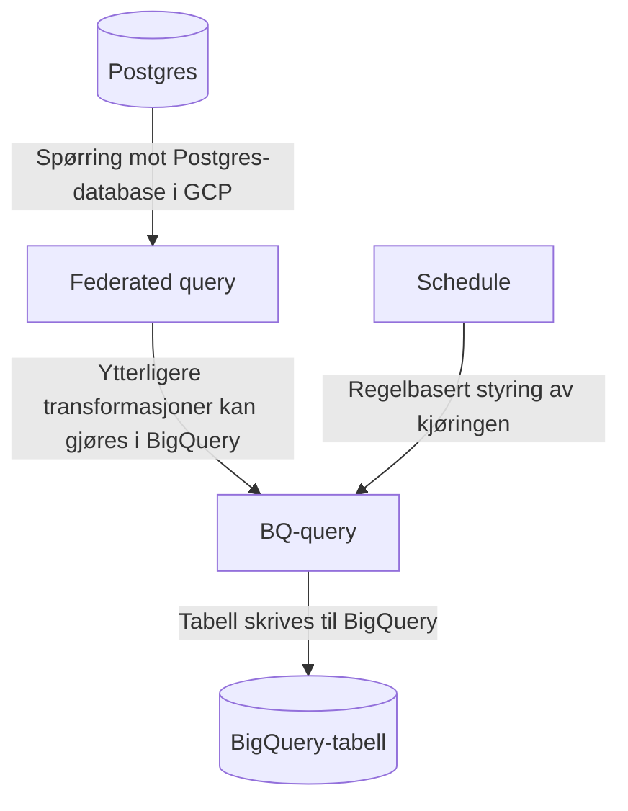

## Postgres til BigQuery 
### Federated query

Federated query brukes typisk til å lese data fra en postgres-database i GCP, transformere disse og skrive til BigQuery.



For å sette opp federated query:

1. [Følg Google sin guide for å sette opp Cloud SQL databasetilkobling](https://cloud.google.com/bigquery/docs/cloud-sql-federated-queries#setting-up-cloud-sql-database-connections)
2. [Følg Google sin guide for å opprette et BigQuery dataset](https://cloud.google.com/bigquery/docs/datasets)
    * Merk at _dataset_ i denne konteksten er noe annet enn [datasett i markedsplassen](../dataprodukt.md#hva-er-et-datasett)
    * Foreløpig kan vi ikke gjenbruke datasets som har blitt opprettet av en nais-applikasjon, da denne overstyrer tilgangene vi oppretter senere i denne guiden
3. [Følg Google sin guide for å lage en Google servicebruker for federated query](https://cloud.google.com/iam/docs/creating-managing-service-accounts)
    * Gi serviceaccounten følgende tilganger på prosjektnivå:
        - _BigQuery Connection User_
        - _BigQuery Job User_
        - _BigQuery Metadata Viewer_
4. [Følg Google sin guide for å gil tilganger til servicebrukeren på datasett](https://cloud.google.com/bigquery/docs/dataset-access-controls)
    * Serviceaccounten trenger rollen _BigQuery Data Editor_

Etter at servicebrukeren har tilgang til datasettet kan man sette opp en spørring som henter data via _external connection_.

Gjennom [Google Cloud Console](https://console.cloud.google.com) kan man velge prosjektet som datasettet tilhører, gå inn på BigQuery og klikke "Compose New Query" til høyre.

Eksempelvis:
```sql
SELECT * FROM EXTERNAL_QUERY(
'europe-north1.<connection_name>',
'''

-- Lag en variabel for versjonering 
WITH constants (version) as (
    values (now())
)

-- Legg inn rader fra Postgres-tabellen med et felt for version-variablen vi definerte over.
SELECT 
    id::text, 
    name, 
    "group", 
    pii, 
    created, 
    last_modified, 
    "type"::text, 
    version
FROM dataproducts, constants
''');
```

#### Kjøre spørring på tidsintervall

For å kjøre en spørring på intervall, så kan du i Query Explorer i Cloud Console velge å definere en "Schedule".

For å få lov til å sette opp eller oppdatere en schedule må din personlige bruker ha noen rettigheter også. 
Disse er for det meste dekket av Bigquery Admin, men hvis du setter opp jobben med en servicebruker (anbefalt) må du også ha tilgang til denne, for eksempel via en midlertidig Service Account Admin.

Klikk "Schedule" og "Create new schedule"


* Name: et passende navn 
* Repeats: Det som passer produktet
* Dataset name: datasettet som ble laget tidligere
* Table name: navn på produkt-tabell
* Advanced options:
    - Service account: servicebrukeren som ble laget tidligere
    
## Kafka til BigQuery
[Under](#kode-eksempler) følger enkle eksempler på hvordan å lese fra Kafka og skrive til BigQuery i forskjellige programmeringsspråk. Alle eksemplene forutsetter at en på forhånd har laget datasettet BigQuery tabellen skal opprettes i og at man har tilgang til å skrive til/opprette tabeller i datasettet. 

### App i GCP cluster
Opprettelsen av datasettet og tilgangene ordnes automatisk dersom appen deployes til gcp clusterne til nais med [nais.yaml](https://doc.nais.io/nais-application/application/#kafka). 

### App i FSS cluster
Men dersom appen skal kjøre i fagsystemsonen er man nødt til å [opprette datasettet](https://cloud.google.com/bigquery/docs/datasets#create-dataset), hente ut en [google service account nøkkel](https://cloud.google.com/iam/docs/creating-managing-service-account-keys#get-key) og gi service accounten følgende roller:

- `BigQuery Job User` i GCP prosjektet gjennom [IAM](https://console.cloud.google.com/iam-admin/iam)
- `BigQuery Data Editor` på datasettet som beskrevet [her](https://cloud.google.com/bigquery/docs/control-access-to-resources-iam#grant_access_to_a_dataset)

Hvis man så mounter inn service account json-nøkkelen i podden til appen kan man sørge for at google klientbiblioteket bruker denne for å autentisere seg dersom man setter miljøvariabelen `GOOGLE_APPLICATION_CREDENTIALS` til stien til hvor credentials filen ligger.

### Kodeeksempler
Eksemplene tar ikke hensyn til autentisering mot Kafka så det antas at man kan lese fra kafka topicet anonymt. For mer informasjon om oppsett av app og autentisering for Kafka i NAV, se [nais docs](https://doc.nais.io/persistence/kafka/application/).

!!!info "Topicet det leses fra i eksemplene har JSON schema og inneholder fire felter: et tekstfelt, et boolean felt, et numerisk felt og et timestamp."

=== "Python"
    Avhengigheter:
    ````
    pip install google-cloud-bigquery kafka-python
    ````
    Kode:
    ````python
    from kafka import KafkaConsumer
    from google.cloud import bigquery
    import json

    def create_kafka_consumer(topic: str, kafka_brokers: []) -> KafkaConsumer:
        return KafkaConsumer(
            topic,
            bootstrap_servers=kafka_brokers,
            api_version=(0, 10),
            auto_offset_reset='earliest',
            enable_auto_commit=True,
            value_deserializer=lambda x: json.loads(x.decode('utf-8'))
        )


    def create_bq_table_if_not_exists(bq_client: bigquery.Client, project_id: str, dataset_id: str, table: str) -> bigquery.Table:
        table_uri = f"{project_id}.{dataset_id}.{table}"

        schema = [
            bigquery.SchemaField("stringValue", "STRING", mode="REQUIRED"),
            bigquery.SchemaField("booleanValue", "BOOLEAN"),
            bigquery.SchemaField("numericValue", "INTEGER"),
            bigquery.SchemaField("timestampValue", "TIMESTAMP"),
        ]

        table = bigquery.Table(table_uri, schema=schema)
        return bq_client.create_table(table, exists_ok=True)


    if __name__ == "__main__":
        project_id = "PROJECT" # erstatt med prosjekt id
        dataset_id = "DATASET" # erstatt med dataset id
        table_name = "TABLE" # erstatt med tabellnavn
        bq_client = bigquery.Client(project=project_id)
        table_id = create_bq_table_if_not_exists(bq_client, project_id, dataset_id, table_name)

        topic_name = "TOPIC" # erstatt med topic navn
        kafka_brokers = ["BROKER1"] # erstatt med liste av brokere
        consumer = create_kafka_consumer(topic_name, kafka_brokers)
        for mesg in consumer:
            print(mesg.value)
            errors = bq_client.insert_rows_json(table_id, [mesg.value])
            if errors != []:
                raise Exception(errors)
    ````

=== "Kotlin"
    Avhengigheter:
    ````
    implementation("com.google.cloud:google-cloud-bigquery:2.22.0")
    implementation("org.apache.kafka:kafka-clients:3.4.0")
    ````

    Kode:
    ````kotlin
    import com.fasterxml.jackson.databind.JsonNode
    import com.fasterxml.jackson.databind.ObjectMapper
    import com.google.cloud.bigquery.*
    import java.time.Duration
    import java.util.*
    import org.apache.kafka.clients.consumer.ConsumerRecords
    import org.apache.kafka.clients.consumer.KafkaConsumer
    import java.time.LocalDateTime
    import java.time.temporal.ChronoUnit

    fun main() {
        val projectId = "PROJECT" // erstatt med prosjektets id
        val datasetId = "DATASET" // erstatt med datasett id
        val tableName = "TABLE" // erstatt med tabellnavn
        val bqClient = BigQueryClient(projectId, datasetId)
        val tableId = bqClient.getOrCreateTable(tableName)

        val topicName = "TOPIC" // erstatt med navn på Kafka topic
        val kafkaBrokers = "BROKERS" // erstatt med navn på brokers
        val consumer = createKafkaConsumer(topicName, kafkaBrokers)

        while (true) {
            val records: ConsumerRecords<String?, String?> = consumer.poll(Duration.ofMillis(100))
            for (record in records) {
                System.out.printf(
                    "offset = %d, key = %s, value = %s%n",
                    record.offset(),
                    record.key(),
                    record.value()
                )
                val value = ObjectMapper().readValue(record.value(), JsonNode::class.java)
                bqClient.insert(tableId, value)
            }
        }
    }

    fun createKafkaConsumer(topicName: String, kafkaBrokers: String): KafkaConsumer<String, String> {
        val props = Properties()
        props.setProperty("bootstrap.servers", kafkaBrokers)
        props.setProperty("group.id", "mygroup")
        props.setProperty("auto.offset.reset", "earliest")
        props.setProperty("key.deserializer", "org.apache.kafka.common.serialization.StringDeserializer")
        props.setProperty("value.deserializer", "org.apache.kafka.common.serialization.StringDeserializer")

        val consumer = KafkaConsumer<String, String>(props)
        consumer.subscribe(Arrays.asList(topicName))

        return consumer
    }

    class BigQueryClient(private val projectId: String, private val datasetId: String) {
        private val bigQuery = BigQueryOptions.newBuilder()
            .setProjectId(projectId)
            .build()
            .service

        fun getOrCreateTable(tableName: String): TableId {
            val tableId = TableId.of(datasetId, tableName)
            val table = bigQuery.getTable(tableId)
            return if (table != null) {
                table.tableId
            }
            else {
                return createTable(tableName)
            }
        }

        private fun createTable(tableName: String): TableId {
            val schema = Schema.of(
                Field.newBuilder("stringValue", StandardSQLTypeName.STRING).setMode(Field.Mode.REQUIRED).build(),
                Field.of("booleanValue", StandardSQLTypeName.BOOL),
                Field.of("numericValue", StandardSQLTypeName.INT64),
                Field.of("timestampValue", StandardSQLTypeName.TIMESTAMP),
            )

            val tableId = TableId.of(datasetId, tableName)
            val tableDefinition = StandardTableDefinition.of(schema)
            val tableInfo = TableInfo.newBuilder(tableId, tableDefinition).build()

            return bigQuery.create(tableInfo).tableId
        }

        fun insert(tableId: TableId, value: JsonNode) {
            val row = InsertAllRequest.RowToInsert.of(mapOf(
                value.use("stringValue") { textValue() },
                value.use("booleanValue") { booleanValue() },
                value.use("numericValue") { intValue() },
                value.use("timestampValue") { LocalDateTime.parse(asText()).truncatedTo(ChronoUnit.MICROS).toString() },
            ))

            val table = bigQuery.getTable(tableId)
            val rows = listOf(row)
            val response = table.insert(rows)
            when {
                response.hasErrors() -> throw RuntimeException(
                    "Lagring i BigQuery feilet: '${response.insertErrors}'"
                )
            }
        }
    }

    fun <T> JsonNode.use(key: String, transform: JsonNode.() -> T): Pair<String, T?> = key to get(key)?.let {
        transform(it)
    }
    ````

=== "Go"
    Avhengigheter:
    ````
    go get "cloud.google.com/go/bigquery"
    go get "github.com/confluentinc/confluent-kafka-go/kafka"
    go get "google.golang.org/api/googleapi"
    ````

    Kode:
    ````go
    package main

    import (
        "context"
        "encoding/json"
        "fmt"
        "os"

        "cloud.google.com/go/bigquery"
        "github.com/confluentinc/confluent-kafka-go/kafka"
        "golang.org/x/xerrors"
        "google.golang.org/api/googleapi"
    )

    type mesg struct {
        StringValue    string `json:"stringValue"`
        BooleanValue   bool   `json:"booleanValue"`
        NumericValue   int    `json:"numericValue"`
        TimestampValue string `json:"timestampValue"`
    }

    const (
        kafkaBroker = "BROKER" // erstatt med kafka broker
        topicName   = "TOPIC" // erstatt med navn på topic

        projectID = "PROJECT" // erstatt med prosjekt id
        datasetID = "DATASET" // erstatt med dataset id
        tableName = "TABLE" // erstatt med navn på tabell
    )

    func main() {
        ctx := context.Background()
        consumer, err := createKafkaConsumer()
        if err != nil {
            panic(err)
        }
        defer consumer.Close()

        bqClient, err := bigquery.NewClient(ctx, projectID)
        if err != nil {
            panic(err)
        }
        defer bqClient.Close()

        table, err := createTableIfNotExists(ctx, bqClient)
        if err != nil {
            panic(err)
        }
        inserter := table.Inserter()

        for {
            event := consumer.Poll(100)
            switch e := event.(type) {
            case *kafka.Message:
                data := mesg{}
                if err := json.Unmarshal(e.Value, &data); err != nil {
                    panic(err)
                }
                fmt.Println(data)
                if err := inserter.Put(ctx, data); err != nil {
                    panic(err)
                }
            case kafka.Error:
                fmt.Fprintf(os.Stderr, "%% Error: %v\n", e)
            default:
                continue
            }
        }
    }

    func createKafkaConsumer() (*kafka.Consumer, error) {
        consumer, err := kafka.NewConsumer(&kafka.ConfigMap{
            "bootstrap.servers": kafkaBroker,
            "group.id":          "mygroup",
            "auto.offset.reset": "earliest",
        })
        if err != nil {
            return nil, err
        }

        err = consumer.SubscribeTopics([]string{topicName}, nil)
        if err != nil {
            return nil, err
        }

        return consumer, nil
    }

    func createTableIfNotExists(ctx context.Context, bqClient *bigquery.Client) (*bigquery.Table, error) {
        schema := bigquery.Schema{
            {Name: "stringValue", Type: bigquery.StringFieldType},
            {Name: "booleanValue", Type: bigquery.BooleanFieldType},
            {Name: "numericValue", Type: bigquery.IntegerFieldType},
            {Name: "timestampValue", Type: bigquery.TimestampFieldType},
        }

        metadata := &bigquery.TableMetadata{
            Schema: schema,
        }

        tableRef := bqClient.Dataset(datasetID).Table(tableName)
        if err := tableRef.Create(ctx, metadata); err != nil {
            var e *googleapi.Error
            if ok := xerrors.As(err, &e); ok {
                if e.Code == 409 {
                    // already exists
                    return tableRef, nil
                }
            }
            return nil, err
        }

        return tableRef, nil
    }
    ````

## Naisjob

NAIS-plattformen tilbyr skedulering av workloads med deres [naisjob-ressurs](https://doc.nais.io/naisjob).

Denne ressurstypen er en abstraksjon på Kubernetes sin [Cronjob](https://kubernetes.io/docs/konsepter/workloads/controllers/cron-jobs/) som gir deg de samme konfigurasjonsmulighetene som man får med NAIS applikasjoner, eksempelvis muligheten til å provisjonere buckets, postgres/BigQuery og kafka-brukere, samt injeksjon av hemmeligheter i kjøremiljøet til jobben ved runtime.

### Bruksområde
Naisjob egner seg godt dersom du trenger å skedulere kjøring av kode, f.eks. periodisk oppdatering av [dataprodukter](../dataprodukt.md) eller [datafortellinger](../../analyse/datafortellinger.md).
