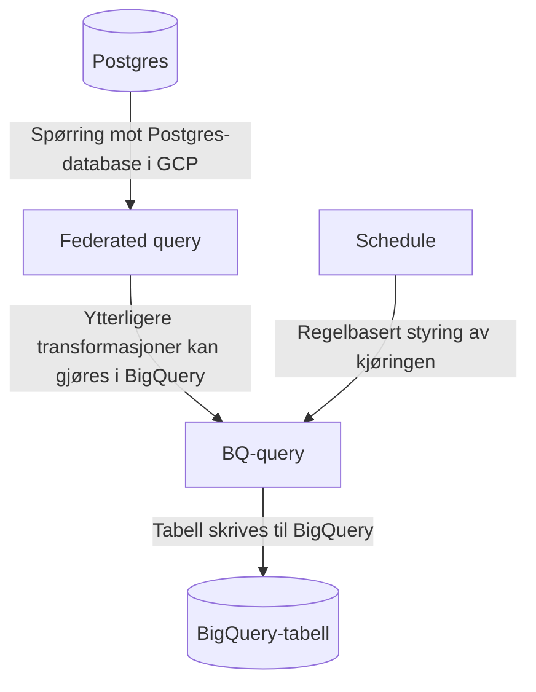

## Federated query

Federated query brukes typisk til å lese data fra en postgres-database i GCP, transformere disse og skrive til BigQuery.



For å sette opp federated query:

1. [Følg Google sin guide for å sette opp Cloud SQL databasetilkobling](https://cloud.google.com/bigquery/docs/cloud-sql-federated-queries#setting-up-cloud-sql-database-connections)
2. [Følg Google sin guide for å opprette et BigQuery dataset](https://cloud.google.com/bigquery/docs/datasets)
    * Merk at _dataset_ i denne konteksten er noe annet enn [datasett i markedsplassen](../dataprodukt.md#hva-er-et-datasett)
    * Foreløpig kan vi ikke gjenbruke datasets som har blitt opprettet av en nais-applikasjon, da denne overstyrer tilgangene vi oppretter senere i denne guiden
3. [Følg Google sin guide for å lage en Google servicebruker for federated query](https://cloud.google.com/iam/docs/creating-managing-service-accounts)
    * Gi serviceaccounten følgende tilganger på prosjektnivå:
        - _BigQuery Connection User_
        - _BigQuery Job User_
        - _BigQuery Metadata Viewer_
4. [Følg Google sin guide for å gil tilganger til servicebrukeren på datasett](https://cloud.google.com/bigquery/docs/dataset-access-controls)
    * Serviceaccounten trenger rollen _BigQuery Data Editor_

Etter at servicebrukeren har tilgang til datasettet kan man sette opp en spørring som henter data via _external connection_.

Gjennom [Google Cloud Console](https://console.cloud.google.com) kan man velge prosjektet som datasettet tilhører, gå inn på BigQuery og klikke "Compose New Query" til høyre.

Eksempelvis:
```sql
SELECT * FROM EXTERNAL_QUERY(
'europe-north1.<connection_name>',
'''

-- Lag en variabel for versjonering 
WITH constants (version) as (
    values (now())
)

-- Legg inn rader fra Postgres-tabellen med et felt for version-variablen vi definerte over.
SELECT 
    id::text, 
    name, 
    "group", 
    pii, 
    created, 
    last_modified, 
    "type"::text, 
    version
FROM dataproducts, constants
''');
```

### Kjøre spørring på tidsintervall

For å kjøre en spørring på intervall, så kan du i Query Explorer i Cloud Console velge å definere en "Schedule".

For å få lov til å sette opp eller oppdatere en schedule må din personlige bruker ha noen rettigheter også. 
Disse er for det meste dekket av Bigquery Admin, men hvis du setter opp jobben med en servicebruker (anbefalt) må du også ha tilgang til denne, for eksempel via en midlertidig Service Account Admin.

Klikk "Schedule" og "Create new schedule"


* Name: et passende navn 
* Repeats: Det som passer produktet
* Dataset name: datasettet som ble laget tidligere
* Table name: navn på produkt-tabell
* Advanced options:
    - Service account: servicebrukeren som ble laget tidligere

## Naisjob

NAIS-plattformen tilbyr skedulering av workloads med deres [naisjob-ressurs](https://doc.nais.io/naisjob).

Denne ressurstypen er en abstraksjon på Kubernetes sin [Cronjob](https://kubernetes.io/docs/konsepter/workloads/controllers/cron-jobs/) som gir deg de samme konfigurasjonsmulighetene som man får med NAIS applikasjoner, eksempelvis muligheten til å provisjonere buckets, postgres/BigQuery og kafka-brukere, samt injeksjon av hemmeligheter i kjøremiljøet til jobben ved runtime.

### Bruksområde
Naisjob egner seg godt dersom du trenger å skedulere kjøring av kode, f.eks. periodisk oppdatering av [dataprodukter](../dataprodukt.md) eller [datafortellinger](../../analyse/datafortellinger.md).

