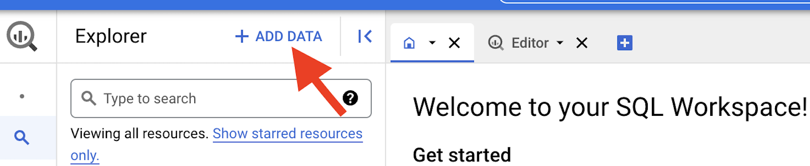
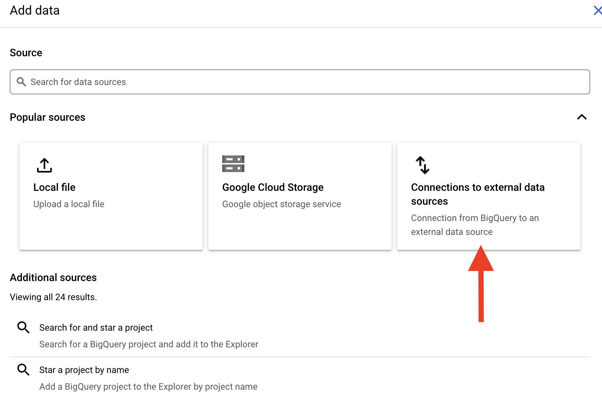
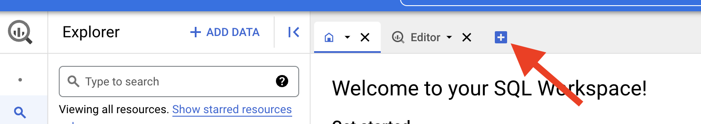

# Skedulering av Federated Queries i GCP
Ved å bruke [Federated Queries](https://cloud.google.com/bigquery/docs/federated-queries-intro) kan man gjøre spørringer mot cloudsql databaser i samme GCP prosjekt og få resultatet som en midlertidig tabell i BigQuery. Derfra kan man enkelt kombinere dette med andre data, persistere det i BigQuery, og skedulere transformasjonen til å kjøre på et gitt intervall.

Den følgende oppskriften dekker alt du trenger for å produksjonssette en slik skedulert spørring mot en cloudsql postgres database. Under er en konseptuell fremstilling av hvordan det henger sammen.


### 1. Lag databasebruker med tilgang til databasen
Lesebrukeren som skal brukes for federated query kan enten opprettes med [nais cli](#opprett-database-bruker-med-nais-cli) eller [manuelt](#opprett-databasebruker-manuelt).

#### Opprett databasebruker med nais cli
Kommandolinjeverktøyet til nais har en egen kommando for tilgang til [postgres](https://docs.nais.io/cli/commands/postgres/#postgres-command) databaser på gcp. Denne har subkommandoen [users add](https://docs.nais.io/cli/commands/postgres/#users-add) for å opprette en bruker med `select` privilegier til public schema i databasen.

#### Opprett databasebruker manuelt
Følg instruksjonene i [NAIS-dokumentasjonen](https://docs.nais.io/persistence/postgres/#personal-database-access) for å koble til databasen.
Når du er inne i databasen, oppretter du og gir tilgang til databasebrukeren med kommandoene nedenfor.
```sql
CREATE USER <brukernavn> WITH ENCRYPTED PASSWORD '<passord>';
GRANT CONNECT ON DATABASE <databasenavn> TO "<brukernavn>";
GRANT USAGE ON SCHEMA public TO <brukernavn>;
```
Videre kan du gi brukeren rettigheter til å lese alle tabeller:
```sql
GRANT SELECT ON ALL TABLES IN SCHEMA public TO <brukernavn>;
```
eller utvalgte tabeller:
```sql
GRANT SELECT ON <tabellnavn> TO <brukernavn>;
```

## 2. Sett opp external connection
-  Gå til [BigQuery](https://console.cloud.google.com/bigquery) i cloud konsollen (sørg for at riktig prosjekt er valgt)
-  Klikk på `+ ADD DATA` som illustrert under



- Klikk på `Connections to external data sources` som illustrert under



- Feltene du må fylle ut er følgende:
    - `Connection type`: sett til `Cloud SQL - PostgreSQL`
    - `Connection ID`: det du vil kalle koblingen (det du setter her er hva du bruker når du skal referere til den fra SQL spørringen senere)
    - `Data location`: må settes til Europa
    - `Cloud SQL connection name`: på format prosjekt:region:instans (du finner den ved å gå [hit](https://console.cloud.google.com/sql/instances) og klikke inn på instansen)
    - `Database name`: navnet på databasen
    - `Database user`: brukernavnet til brukeren opprettet [tidligere](#1-lag-databasebruker-med-tilgang-til-databasen)
    - `Database password`: passordet til brukeren opprettet [tidligere](#1-lag-databasebruker-med-tilgang-til-databasen)
- Klikk `Create Connection`

### 3. Opprett eget datasett for dataproduktet
Følg [Google sin guide](https://cloud.google.com/bigquery/docs/datasets).
Foreløpig kan vi ikke gjenbruke datasett som har blitt opprettet av en nais-applikasjon, da denne overstyrer tilgangene vi oppretter senere i denne guiden.

### 4. Opprett IAM service account som skal kjøre den skedulerte querien
Følg [Google sin guide](https://cloud.google.com/iam/docs/creating-managing-service-accounts).
Gi serviceaccounten følgende tilganger på prosjektnivå:

- BigQuery Connection User
- BigQuery Job User
- BigQuery Metadata Viewer

### 5. Gi tilganger til serviceaccount på dataset
Følg [Google sin guide](https://cloud.google.com/bigquery/docs/dataset-access-controls).
Serviceaccounten trenger rollen `BigQuery Data Editor`

### 6. Sett opp spørringen som henter data via external connection
- Gå til [BigQuery](https://console.cloud.google.com/bigquery) i cloud consollen
- Klikk på `+` (Compose New Query) som illustrert under



- Eksempelspørring :
```sql
SELECT * FROM EXTERNAL_QUERY(
'europe-north1.<connection ID>',
'''

-- Lag en variabel for varsjonering 
WITH constants (version) as (
values (now())
)

-- Legg inn rader fra Postgres-tabellen med et felt for version-variablen vi definerte over.
SELECT id::text, name, "group", pii, created, last_modified, "type"::text, version
FROM dataproducts,constants
''');
```

### 7. Kjør spørring på tidsintervall
For å få lov til å sette opp eller oppdatere en schedule må din personlige bruker ha noen rettigheter også. Disse er for det meste dekket av `Bigquery Admin`, men hvis du setter opp jobben med en servicebruker (anbefalt) må du også ha tilgang til denne, for eksempel via en midlertidig `Service Account Admin`

For å kjøre spørringen på intervall, så kan du i Query Explorer i Cloud Console velge å definere en `Schedule`

Klikk "Schedule" og "Create new schedule"


- `Name for scheduled query`: et passende navn 
- `Repeats`: det som passer produktet
- `Dataset name`: datasettet som ble laget tidligere i guiden
- `Table name`: navn på tabell
- `Data location`: må settes til Europa
- `advanced options`:
    - `service account`: service account som ble laget [tidligere](#4-opprett-iam-service-account-som-skal-kjøre-den-skedulerte-querien)
