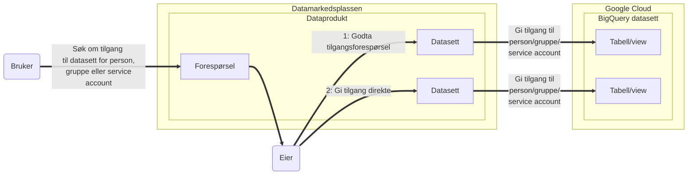

Datasett er i utgangspunktet kun tilgjengelig for teamet som eier dataene.
Det betyr at ingen kan se dataene frem til eier gjør et **aktivt** valg om å gi andre tilgang.

Dersom datasettet ikke inneholder personopplysninger, kan man ved oppretting av datasett gi tilgang til alle i NAV.
I praksis betyr det at folk som har lagt til Google Cloud Platform i [myapps.microsoft.com](https://myapps.microsoft.com) kan se dataen i datasettet.

## Gi tilgang til view/tabell
Tilganger gis per view/tabell i BigQuery.
Det betyr at team kan ha view/tabeller i BigQuery som er tilgjengelig for forskjellige grupper.
Når en bruker får tilgang til *dataene* i et view/tabell, gis de de også `metadata viewer` i BigQuery-datasettet.
Dette gir *ikke* tilgang til andre views/tabeller, men det er mulig å se metadata for de andre viewene/tabellene i BigQuery-datasettet.

Tilganger til viewene/tabellene som er del av datasettene forvaltes gjennom [Datamarkedsplassen](https://data.intern.nav.no/).

Det er to måter å gi tilgang til et datasett på.

### Manuelt
Som eier kan man manuelt gi tilgang for en annen bruker, en servicebruker eller ei gruppe.
For å få tilgang til datasett som inneholder personopplysninger må det finnes en relevant behandling i [Behandlingskatalogen](https://behandlingskatalog.nais.adeo.no/).

- Navigér til datasettet
- Velg Legg til tilgang under _Aktive tilganger_-seksjonen
- Fyll ut skjema
    - Du kan gi tilgang for en annen bruker, en servicebruker eller ei gruppe. I alle tre tilfellene bruker du e-post-adressen.
    - Du kan velge hvor lenge tilgangen skal vare; til en gitt dato eller for alltid.

#### Views og Materialized Views
Når man oppretter [Views](https://cloud.google.com/bigquery/docs/views)/[Materialized Views](https://cloud.google.com/bigquery/docs/materialized-views-intro) i BigQuery vil i utgangspunktet disse kreve at en bruker har tilgang til alle underliggende tabeller som viewet bygger på for å kunne lese det. For å unngå det kan man [autorisere viewet](https://cloud.google.com/bigquery/docs/share-access-views) i datasett(ene) til de underliggende tabellene viewet bygger på. Å gjøre dette gir mulighet for å kunne gi brukere tilgang til viewet alene, og ikke de underliggende tabellene.

Når man i [Datamarkedsplassen](https://data.intern.nav.no/) lager et datasett som er et BigQuery View eller Materialized View vil vi automatisk autorisere viewet i BigQuery datasettet til viewet. Det betyr at dersom alle underliggende tabeller finnes i samme BigQuery datasett så kan man uten videre gi tilgang til det på samme måte som med tabeller gjennom Datamarkedsplassen. 

Men dersom viewet bygger på tabeller som ligger i andre BigQuery datasett enn det viewet selv ligger i må man manuelt [autorisere viewet](https://cloud.google.com/bigquery/docs/share-access-views#authorize_the_view_to_access_the_source_dataset) i disse BigQuery datasettene også.

### Godkjenne en søknad

Som eier kan man godkjenne tilgangssøknader.

- Navigér til datasettet
- Under tilgangssøknader kan du se søknader til godkjenning
- Bekreft at det finnes en relevant behandling i [Behandlingskatalogen](https://behandlingskatalog.nais.adeo.no/)
    - Du trenger ikke kvalitetssikre innholdet i behandlingen
- Trykk Godkjenn eller Avslå
    - Dersom du avslår en søknad har du mulighet til å oppgi grunn

## Fjern tilgang

Som eier kan man fjerne tilgang.

- Navigér til datasettet
- Under aktive tilganger har du et valg om å fjerne tilgang

## Søke om tilgang

Dersom man ønsker å få tilgang til et datasett må man i utgangspunktet ha et behandlingsgrunnlag dokumentert i [Behandlingskatalogen](https://behandlingskatalog.nais.adeo.no/).
For å søke om tilgang til et datasett på Datamarkedsplassen:

- Navigér til datasettet
- Dersom du ikke har lesetilgang til datasettet er det markert på toppen med en blå linje.
- Trykk på lenken _Søk om tilgang_
- Fyll ut skjema
    - Du kan søke om tilgang til deg selv, en annen bruker, en servicebruker eller ei gruppe
    - Du kan velge hvor lenge tilgangen skal vare; til en gitt dato eller for alltid
    - Du kan søke opp en behandling i Behandlingskatalogen ved å søke på navnet på behandlingen

## Tilgangsstyring gjennom Datamarkedsplassen
Under er en enkel skisse av hvordan tilgang til datasett i dataprodukter søkes om og gis gjennom Datamarkedsplassen. Det er to måter å få tilgang til et datasett i Datamarkedsplassen:

1. En bruker kan initiere dette selv ved å opprette en tilgangsforespørsel for enten enkeltbruker, en gruppe eller en service account. Denne tilgangsforespørselen må så godtas av en av eierene av dataproduktet datasettet er en del av. Dersom denne forespørselen godtas vil Datamarkedsplassen gi tilgangen i BigQuery til den eller de brukerene det ble søkt om tilgang for.
2. En eier kan også gi tilgang til enkeltbrukere, grupper eller service accounts direkte uten at det først må bli laget en tilgangsforespørsel.

## Gi tilganger i GCP konsoll direkte
Dersom du ønsker å se tilganger gitt eller gi tilganger til en bigquery tabell direkte utenom [Datamarkedsplassen](https://data.intern.nav.no), se [google docs](https://cloud.google.com/bigquery/docs/control-access-to-resources-iam)
