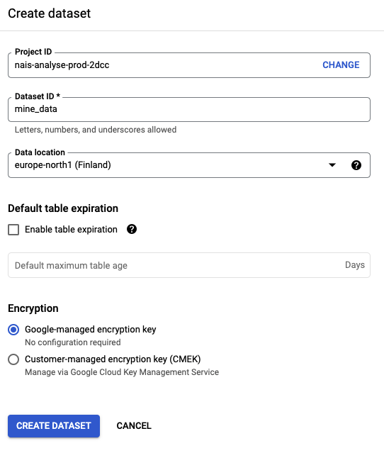

# Laste opp fil til BigQuery

For å legge til data i BigQuery manuelt kan man laste opp en fil til et datasett man eier.

## Finn frem til riktig sted i GCP-konsollet
* Naviger til https://console.cloud.google.com/ og logg inn med din @nav.no-konto.
* Velg "BigQuery" i menyen til venstre (eller fra søkefeltet i toppen)
* Finn ditt teams prosjekt ved å søke i Explorer-vinduet eller i listen over _pinned projects_.

I BigQuery er hierarkiet **prosject > dataset > table/view**. 
Du kan selv opprette datasett og tabeller og view som du ønsker innenfor dine prosjekter.
ALle tabeller og view må ligge i et datasett.

## Opprett et datasett
Klikk på de tre prikkene til høyre på ditt prosjekt i _pinned projects_-listen og velg "Create dataset".

<kbd></kbd>

Fyll inn detaljer for datasettet ditt.

Merk at "Data location" **skal være** `europe-north1`.

<kbd></kbd>

## Last opp en fil til en ny tabell
Klikk på de tre prikkene til høyre i datasettet ditt, og velg "Create table".

<kbd></kbd>

I vinduet som popper opp velger du "Create table from" --> "Upload". Så velger du fil og filformat.

Under "Destination" velger du ditt prosjekt og datasett, og gir tabellen et navn.

Schema kan du så redigere - merk at det er lurt å spesifisere riktig datatype for hvert felt. 

<kbd></kbd>

Trykk "Create table". Voila!