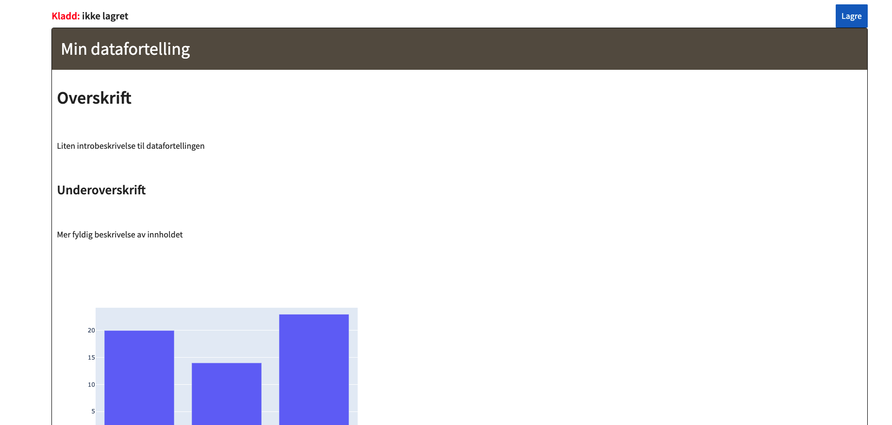

Datafortellinger brukes til å dele innsikt i form av statiske dokumenter som består av tekstkomponenter (`markdown`) og visualiseringer (`plotly`og `vega`).
Datafortellinger produseres enklest gjennom en notebook og kan enkelt deles med andre i NAV.

## Installer datastory bibliotek
````bash
pip install datastory
````

## API adresser
For å publisere en datafortelling må man angi en api adressen det skal publiseres til.

- For [dev-miljøet](https://data.dev.intern.nav.no) er denne adressen `https://nada.ekstern.dev.nav.no/api`
- For [prod-miljøet](https://data.intern.nav.no) er denne adressen `https://nada.intern.nav.no/api`

I kodeeksemplene som følger brukes dev adressen.

## Lage utkast til datafortelling
````python
from datastory import DataStory

ds = DataStory("Min datafortelling")

ds.header("Overskrift")
ds.markdown("Liten introbeskrivelse til datafortellingen")
ds.header("Underoverskrift", level=2)
ds.markdown("Mer fyldig beskrivelse av innholdet")
ds.header("Figur 1 tittel", level=3)
ds.plotly(fig_plotly_as_jason)
ds.markdown("Beskrivelse av figur 1")
ds.header("Figur 2 tittel", level=3)
ds.vega(fig_vega)
ds.markdown("Beskrivelse av figur 2")

ds.publish(url="https://nada.ekstern.dev.nav.no/api")
````

Når man kaller `ds.publish()` i eksempelet over vil det bli opprettet en kladd til en datafortelling, se [her](#publisere-datafortelling) 
for å se hvordan man publiserer en datafortelling fra en kladd.

## Publisere datafortelling
Publisering av en datafortelling gjøres fra kladd-visningen i datamarkedsplassen som følger:

1. Logg inn
2. Trykk lagre

3. Velg hvilket av dine team som skal eie datafortellingen

## Oppdatere eksisterende datafortelling
For å oppdatere en publisert datafortelling programmatisk må man autentisere seg med et token. 
Dette tokenet blir generert når man publiserer en kladd og kan hentes ut ved å gå til den publiserte datafortellingen og fra [kebab menyen](https://uxplanet.org/choose-correct-menu-icon-for-your-navigation-7ffc22df80ac#160b) velge `vis token`.
Når du har fått hentet ut oppdateringstokenet kan du erstatte siste kodelinje i eksempelet over (dvs. `ds.publish()`) med en metode som i stedet oppdaterer datafortellingen.

````python
ds.update(token="mitt-token", url="https://nada.ekstern.dev.nav.no/api")
````

Dersom man ønsker å unngå å sette api adressen til nav data som input parameter til `ds.publish()` og `ds.update()` metodene kan man i stedet sette det som miljøvariabel, f.eks.
````python
import os
os.environ["DATASTORY_URL"] = "https://nada.ekstern.dev.nav.no/api"
````
