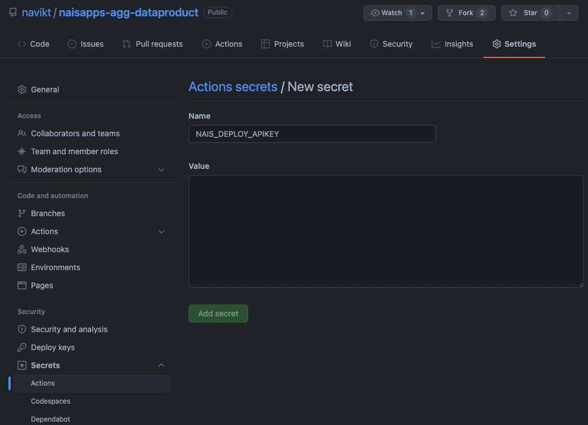

# How to: Python ETL-pipeline på nais 101

## Introduksjon
I denne guiden viser vi hvordan vi kan lage en data pipeline ("ETL-pipeline") i python og sette denne i produksjon på nais.
Vi vil i eksempelet lese data fra et dataprodukt som ligger på [datamarkedsplassen](../finne-data/navdata.md),
gjøre noen enkle transformasjoner, og skrive data tilbake til en tabell i BigQuery. 
Vi vil skrive tester for transformasjonene våre, slik at vi er trygge på at de gjør det de skal også når vi endrer koden i fremtiden.
Til slutt vil vi pakke koden vår inn i en kjørende container som vi setter i produksjon. 
Vi vil sette pipelinen vår til å kjøre én gang i døgnet ved hjelp av en [naisjob](https://docs.nais.io/naisjob/).

Målgruppen for denne guiden er datautviklere som kan litt python og skal lage data pipelines.

Ved å bruke nais som plattform for pipelinen vår får vi mye gratis. 
Vi får et robust og veltestet kjøretidsmiljø, tilgang på logger og metrikker og alerts, i tillegg til enkle provisjoneringsmekanismer for BigQuery-datasett og hemmeligheter og slikt.

All koden vi bruker i eksemplet under ligger [på github](https://github.com/navikt/naisapps-agg-dataproduct).

## Grunnleggende konsepter
### Docker / containere
Alle applikasjoner (og data pipelinen vi skal lage er i praksis en applikasjon) må pakkes inn i en container for å kunne kjøre på nais.
En "container" i denne konteksten betyr at vi pakker inn koden vår sammen med alle avhengigheter koden måtte ha. 
I praksis trenger et pythonscript et operativsystem med python installert, samt alle biblioteker vi skal benytte. 
Vi kommer til å lage en container som inneholder et Linux-basert operativsystem, python 3.9 samt alle bibliotekene vi har definert i vår `requirements.txt`.

### Kubernetes, nais og applikasjonsmanifestet
*For en utfyllende beskrivelse av nais bør man lese seg litt opp på [nais-dokumentasjonen](https://docs.nais.io/).*

Enhver applikasjon må kjøre et sted. I NAV kjører vi applikasjonene våre på [kubernetes](https://kubernetes.io/), 
som er et virtualiseringslaget på toppen av "stålet", altså datamaskinene som står i en datahall et sted. 
Kubernetes er et veldig kraftig verktøy, men det er også ganske komplisert å konfigurere og å bruke. 
Dette er der nais kommer inn: vi har i praksis skjult mye av kompleksiteten ved å gjøre en del default-valg, 
og gjort det mulig å sette en applikasjon i produksjon på kubernetes [kun med noen få linjer konfigurasjon](https://docs.nais.io/basics/application/).

Konfigurasjonen man må skrive for at en applikasjon skal kunne kjøre på nais kalles et [applikasjonsmanifest.](https://docs.nais.io/nais-application/application/)
For nais-apper kalles dette manifestet som regel `nais.yaml`. 

### Nais-job
Dersom man ikke har behov for en applikasjon som kjører hele tiden, men i stedet har et script eller lignende som skal gjøre én ting og så være ferdig kan man benytte seg av en `job` i stedet for en applikasjon.
En `job` starter opp på samme måte som en applikasjon på kubernetes, men når den har gjort det den skal blir den terminert og alle ressurser den opprettet i clusteret blir frigitt.

Ved hjelp av [naisjob](https://docs.nais.io/naisjob/) kan vi enkelt definere en job som kjører på faste tidspunkter, angitt på [crontab-format](https://crontab.guru/).
Bortsett fra at `job`en blir borte når den er ferdig oppfører naisjobs seg stort sett som applikasjoner.

### CI/CD-pipeline
CI/CD (continous integration/deployment) gjør at *team* raskt kan publisere endringer på en tryggere måte.
Noe av dette får vi utbytte av uavhengig av hva vi aktivt velger å gjøre.
Eksempelvis vil det være sjekker av hvorvidt credentials er inkludert i repoet. 
For å få fullt utbytte av CI/CD må vi i tillegg aktivt inkludere en del innhold.
Enhetstester er et eksempel på dette, der CI-løpet vil trigge alle testene som er inkludert i repoet.
Dersom noen av testene ikke returnerer verdien som forventes under forutsetningene lagt inn i testen, vil utvikler umiddelbart få tilbakemelding og pipelinen stanses.

## En enkel datapipeline
Vi illustrerer hvordan vi kan sette disse bestanddelene sammen gjennom i en enkel datapipeline i python.
I dette eksempelet leser vi inn dataproduktet [Applikasjoner på nais](https://data.intern.nav.no/dataproduct/2ed94917-2f31-4582-9456-01e77bcb11d6/info),
som inneholder daglige snapshots av alle applikasjoner i alle nais-miljøene. 
Vi ønsker å lage et nytt datasett som inneholde antall applikasjoner i henholdsvis `dev` og `prod` hver dag, samt antall applikasjoner i "skyen" og i "onprem" hver dag.
Resultatet ønsker vi å skrive til en tabell, og vi ønsker å oppdatere dette hver dag.

### Lese fra en kilde
Siden dataproduktet vi skal lese er tilgjengelig for alle i NAV trenger vi ikke gjøre noe spesielt for å gi appen vår tilgang til dataene.
Dersom vi skulle lest data som var strengere tilgangsbegrensning på måtte vi sørget for at servicebrukeren som applikasjonen vår kjører som hadde tilgang, men dette slipper vi å tenke på i dette tilfellet.
Vi kan adressen til dataene i datamarkedsplassen, og siden dataene ligger i BigQuery kan vi lese ut dataene med `pandas_gbq`.

#### **`main.py:`**
````
import pandas_gbq

query = 'SELECT * FROM `aura-prod-d7e3.dataproduct_apps.dataproduct_apps_unique`'
df = pandas_gbq.read_gbq(query)
````

### Test-drevet transformasjon
Kilden vår inneholder én rad per snapshot per applikasjon (og per kubernetes-cluster). 
Det vi ønsker er å telle antall apper per dato langs to dimensjoner: miljø og datasenter. 
Vi gjør dette med en funksjon `count_apps` som tar inn en dataframe og returnerer en dataframe.
#### **`main.py:`**
````
def count_apps(df):
  # tellelogikk her
  
  return df
````

Vi vet det trengs litt logikk for å gjøre denne tellingen. 
Siden vi innfører logikk i transformasjonen bør vi også skrive noen tester som sjekker at logikken oppfører seg slik vi forventer.
I god [TDD-ånd](https://en.wikipedia.org/wiki/Test-driven_development) skriver vi testen først og logikken etterpå.

Vi starter med å plukke ut noen utvalgte rader fra kilden.

#### **`test_data.csv:`**
```
name,cluster,dato,namespace,collection_time,team,image,ingresses
aap-soknad,dev-gcp,2022-20-01,aap,2021-10-30T06:13:21.987354,aap,ghcr.io/navikt/aap-soknad:6db957cb289399bcd11b94d9b446e1355b43e9cf,"[""https://aap-soknad.dev.nav.no""]"
sykefravarsstatistikk,dev-sbs,2022-20-01,arbeidsgiver,2021-12-14T05:13:11.853793,arbeidsgiver,docker.pkg.github.com/navikt/sykefravarsstatistikk/sykefravarsstatistikk:0d913f743c9dcfba540102ace4a1c9037f3a042c,"[""https://arbeidsgiver-q.nav.no/sykefravarsstatistikk"",""https://arbeidsgiver.dev.nav.no/sykefravarsstatistikk""]"
babylon,prod-sbs,2022-20-01,aura,2022-01-10T05:13:13.112980,aura,ghcr.io/nais/babylon:9576e3d9ac96720e42066c5b93a9c16d8701e10c,[]
aareg-otp-api,prod-fss,2022-20-01,arbeidsforhold,2022-01-13T05:13:04.906122,arbeidsforhold,docker.pkg.github.com/navikt/aareg/aareg-otp-api:48eba9e222e6615194f5c6dfa6b65e57b01505ed,"[""https://aareg-otp-api.nais.adeo.no""]"
altinnkanal-2,dev-fss,2022-20-01,alf,2021-11-23T05:13:15.383399,alf,ghcr.io/navikt/altinnkanal-2/altinnkanal-2:49b25721a4df4dcf85e70723856b09ce78ce21f3,"[""https://altinnkanal-2.nais.preprod.local""]"
tilretteleggingsbehov-innsyn,prod-gcp,2022-20-01,arbeidsgiver,2021-11-15T05:13:22.296495,arbeidsgiver,docker.pkg.github.com/navikt/tilretteleggingsbehov-innsyn/tilretteleggingsbehov-innsyn:07899ba344904308c1000fb709e5aa293bf5681c,"[""https://www.nav.no/person/behov-for-tilrettelegging""]"
```

Gitt disse dataene kan vi si noe om hva vi forventer å se etter transformasjonene våre. 
Vi bruker rammeverket [unittest](https://docs.python.org/3/library/unittest.html) for å definere tester, som vi så kan kjøre med [pytest](https://docs.pytest.org/en/6.2.x/).

Først leser vi inn testdataene i en dataframe, og så kjører dataframen gjennom funksjonen `count_apps`. 
I testene som følger ser vi kun på antallet for en spesifikk dato (20. januar 2022).
#### **`test_transformations.py`**
```
import unittest
import pandas as pd

from main import count_apps

class TestAggregations(unittest.TestCase):
    def setUp(self):
        df_testdata = pd.read_csv('test_data.csv', sep=',')
        df = count_apps(df_testdata)
        self.df = df[df['dato'] ==  '2022-20-01']
```

Vi vet at denne funksjonen ikke gjør noe ennå, men det er helt greit. 
La oss definere noen forventede utfall:

#### **`test_transformations.py`**
```
    def test_prodcount(self):
        df = self.df
        antall_apper = df[(df['env'] == 'prod')]['antall_apper'].sum()
        self.assertTrue(antall_apper == 3)
        
    def test_devcount(self):
        df = self.df
        antall_apper = df[(df['env'] == 'dev')]['antall_apper'].sum()
        self.assertTrue(antall_apper == 3)        

    def test_cloud_count(self):
        df = self.df
        antall_apper = df[df['datacenter'] == 'gcp']['antall_apper'].sum()
        self.assertTrue(antall_apper == 2)

    def test_onprem_count(self):
        df = self.df
        antall_apper = df[df['datacenter'] == 'on_prem']['antall_apper'].sum()
        self.assertTrue(antall_apper == 4)
```

Vi vet at alle radene i testdataene våre har samme dato. 
Vi vet dessuten at det er én app fra hvert av clustrene i testdataene, så en tellefunksjon burde resultere i 3 apper i prod, 3 apper i dev, 4 apper onprem og 2 apper i skyen.

Hvis vi nå kjører testene med `pytest` får vi errors og test fails fordi funksjonen vår gjør ikke det vi forventer ennå.
Men siden vi har testene nå kan vi begynne å lage logikken, og være ganske trygge på at logikken er riktig når testene blir grønne.

#### **`main.py`**
```
def count_apps(df):
    df['antall_apper'] = 1

    df['env'] = 'dev'
    df.loc[df['cluster'].str.contains('prod'), 'env'] = 'prod'

    df['datacenter'] = 'on_prem'
    df.loc[df['cluster'].str.contains('gcp'), 'datacenter'] = 'gcp'

    df = df.groupby(['dato', 'env', 'datacenter'])['antall_apper'].count().reset_index()

    return df
```

Når vi nå kjører `pytest` er testene grønne!

### Skrive resultatet til en ny tabell
Det neste steget er å skrive resultatet vårt til en tabell. 
Vi skriver til en tabell i BigQuery i dette tilfellet.

#### **`main.py`**
````
project_id = 'nais-analyse-prod-2dcc'
dataset = 'apps_aggregated'
table = 'apps_per_env'

destination_table = f'{project_id}.{dataset}.{table}'

table_schema = [
  {'name': 'dato', 'type': 'DATE'},
  {'name': 'env', 'type': 'STRING'},
  {'name': 'datacenter', 'type': 'STRING'},
  {'name': 'antall_apper', 'type': 'INT'}
]

df.to_gbq(
  destination_table=destination_table, 
  table_schema=table_schema,
  if_exists='replace'
)

````
Project ID er IDen på GCP-prosjektet hvor datasettet ditt skal leve. 
Dette er typisk oppkalt etter ditt teamnavn.

Datasettet må vi opprette før vi kan skrive dit. 
Det gjør vi i applikasjonsmanifestet vårt.
Det vil derfor ikke fungere å skrive til BigQuery før vi har applyet applikasjonsmanifestet første gang.
I praksis vil vi gjøre dette i vår CI/CD pipeline under.

Tabellen opprettes automatisk med schema vi angir når vi bruker [`to_gbq`](https://pandas.pydata.org/docs/reference/api/pandas.DataFrame.to_gbq.html).
Vi har her valgt en replace-strategi, men man kan for eksempel velge append i stedet. Se [dokumentasjon av biblioteket](https://pandas.pydata.org/docs/reference/api/pandas.DataFrame.to_gbq.html).

## Applikasjonsmanifest
Vi skal lage en naisjob, og den beskriver vi i et manifest.

#### *`naisjob.yaml`*
```
apiVersion: nais.io/v1
kind: Naisjob
metadata:
  labels:
    team: nais-analyse
  name: naisapps-agg-dataproduct
  namespace: nais-analyse
spec:
  image: {{image}}
  schedule: "30 6 * * *"
  gcp:
    bigQueryDatasets:
      - name: apps_aggregated
        permission: READWRITE
```
Joben må ha et navn, tilhøre et team og kjøre i det teamets namespace på nais.
I tillegg må den ha en schedule, som i dette tilfellet er kl 0630 hver dag.

Så må job'en vite hvilken kode den skal kjøre - altså hvilket dockerimage som skal spinnes opp og kjøre til det er ferdig kl 0630 hver dag.
Navnet på imaget vil endre seg hver gang vi gjør endringer i koden, så vi bruker en miljøvariabel `IMAGE` til å representere dette, som blir skutt inn av CI/CD-pipelinen vår.

Til slutt må vi beskrive BigQuery-datasettet vi skal opprette. 
Ved å beskrive det i manifestet vil det automatisk bli provisjonert av nais når appen deployes første gang.
Dette betyr at datasettet blir opprettet og at riktige tilganger blir satt på dette slik at vi som er i teamet som eier appen kan benytte datasettet slik vi vil.

## CI/CD-pipeline
For å sy alt dette sammen lager vi oss en automatisk pipeline. 
Hver gang vi pusher endringer i koden til github ønsker vi at pipelinen vår skal gjøre følgende:
1. Sett opp python 3.9 
2. Installer alle dependencies som er angitt i requirements.txt
3. Installer pytest
4. Kjør testene våre (og dersom noen tester feiler så stopp pipelinen)
5. Bygg et dockerimage av appen vår
6. Last opp imaget til et image repository 
7. Kjør applikasjonsmanifestet (som peker på imaget fra punkt 6.) ut i nais-clusteret `prod-gcp`

Når alt dette er gjort vil nais ta over og sørge for at datapipelinen vår kjøres hver dag kl 0630.

Vi bruker [Github Actions](https://docs.github.com/en/actions) til å lage denne pipelinen. For at dette skal fungere må vi lage en yaml-fil som beskriver actionen vår i en mappe som heter `.github/workflows`.

#### *`.github/workflows/main.yaml`*
```
name: "Build and deploy naisapps-agg-dataproduct naisjob"
on:
  push:
    branches:
      - "main"

env:
  "IMAGE": docker.pkg.github.com/${{ github.repository }}/deploy-datapipeline:${{ github.sha }}

jobs:
  build:
    name: "build"
    runs-on: "ubuntu-latest"
    steps:
      - uses: "actions/checkout@v2"
      - name: Set up Python 3.9
        uses: actions/setup-python@v2
        with:
          python-version: 3.9
      - name: Install dependencies
        run: |
          python -m pip install --upgrade pip
          pip install pytest
          if [ -f requirements.txt ]; then pip install -r requirements.txt; fi
      - name: Test with pytest
        run: |
          pytest
      - name: Build and push docker image
        run: "docker build --pull --tag ${IMAGE} . && echo $GITHUB_TOKEN | docker login\
                \ --username $GITHUB_REPOSITORY --password-stdin https://docker.pkg.github.com\
                \ && docker push ${IMAGE}"
        env:
          GITHUB_TOKEN: ${{ secrets.GITHUB_TOKEN }}
  deployToProd:
    name: "Deploy to prod"
    needs: build
    runs-on: "ubuntu-latest"
    steps:
      - uses: "actions/checkout@v2"
      - name: "Deploy to prod-gcp"
        uses: "nais/deploy/actions/deploy@v1"
        env:
          "APIKEY": "${{ secrets.NAIS_DEPLOY_APIKEY }}"
          "CLUSTER": "prod-gcp"
          "RESOURCE": "naisjob.yaml"
```

Det siste elementet som må på plass for at dette skal fungere er en nøkkel for nais deploy-APIet som beviser at vi er eiere av denne appen og dermed skal ha rettighet til å sende slike applikasjonsmanifest som dette til nais.
Den kan vi hente under API-keys på [deploy.nais.io](https://deploy.nais.io/apikeys).
(Trykk "Copy key".)

Siden dette er en hemmelighet vil vi ikke oppbevare den i koden vår.
I stedet putter vi den inn i settings i repositoriet vårt på github under secrets, slik at github kan dytte nøkkelen inn i Action'en når den kjøres.
Gi secreten navnet `NAIS_DEPLOY_APIKEY`, lim inn nøkkelen, og lagre.



Siden repositoriet eies av oss er det kun de som er i vårt team som har tilgang til å redigere repository-secrets.
Det er også kun vårt team som har tilgang til å endre på koden i repositoriet, og slik sikrer vi at kun medlemmer av vårt team kan gjøre endringer på datapipelinen.

## Oppsummering
For å sette en data pipeline i drift på nais trenger man et github-repo som inneholder:
* En datapipeline (i dette eksempelet implementert i python i `main.py`)
* En `Dockerfile`
* Et manifest (`nais.yaml`)
* En CI/CD-pipeline (`.github/workflows/main.yaml`)
* En nais API-key i github-repositoriet sitt

I tillegg er det lurt å ha noen tester som man kjører som en del av sin CI/CD-pipeline.

Når job'en er oppe og går har man tilgang til alle verktøy for observability som alle apper på nais har. 
Se [doc.nais.io](https://doc.nais.io/) for en nærmere beskrivelse av disse.
Man kan også følge med på job'en med [kubectl](https://kubernetes.io/docs/reference/kubectl/overview/).