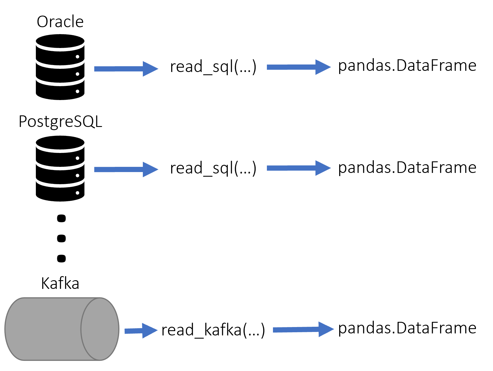

[Dataverk](https://pypi.org/project/dataverk) er et python bibliotek for datatilgang, 
samt lagring og publisering av data. Hensikten er å
forenkle hverdagen til analytikere, data scientists og andre som jobber kodebasert
med data i NAV gjennom å standardisere lesing fra ulike kilder og lagring av resultater. På den måten 
kan brukerne konsentrere seg om å analysere og eksperimentere fremfor å måtte 
slite med ***hvordan*** man får hentet data fra kilder og skrevet til datalagre (datasinks).

#### Tilgang til datakilder
Biblioteket tilbyr konnektorer mot ulike typer datakilder, eksempelvis oracle, postgreSQL og kafka. Felles 
for konnektorene er at de alle returnerer data på det samme formatet - som en [pandas](https://pandas.pydata.org/docs) dataframe. 
Dette gjør at man kan benytte seg av alt pandas tilbyr av funksjonalitet for å 
utføre transformasjoner og mutasjoner på datasett, samt kombinere data fra ulike kilder.  



#### Lagring og publisering av resultater
For lagring av resultater tilbys det konnektorer mot ulike typer datalagre, f.eks. nais S3
og google cloud storage. Disse kan enten brukes direkte, eller
så kan man benytte seg av publiseringsmekanismen som kommer med dataverk biblioteket.

Å publisere med dataverk innebærer følgende:
1. Bearbeidede data, lage visualiseringer og skrive tekst i notebooken
2. Publisere en datapakke

Når man har publisert en "datapakke" vil denne være tilgjengelig 
enten i den [interne](https://data.adeo.no) eller den [eksterne](https://dataverk.nav.no)
datakatalogen.

#### Anonymisering og prikking
Biblioteket har også metoder for å utføre enkel anonymisering og prikking av
datasett.

## Hva kan man bruke det til?
- Analyse av data
- Eksperimentering med data
- Publisering av data internt eller eksternt
- Jobbe kodebasert med ett verktøy hele veien fra rådata til ferdig produkt 

## Hvordan komme i gang?

### Fra JupyterHub
Det anbefales å jobbe i jupyter notebook for at det skal
være enklest å komme i gang. Dette fordi:
1. Dataverk har en del eksterne avhengigheter som må være installert i det miljøet man 
jobber (oracle client, postgres driver etc.). Disse avhengighetene vil være installert 
i dockerimaget som notebook serveren bruker.
3. Enklere og sikrere håndtering av secrets. Ved bruk av jupyterhub håndteres dette likt
som applikasjoner på nais, dvs. secrets (f.eks. database credentials) mountes inn
i containermiljøet og trenger ikke være lagret lokalt.

### Uten Jupyterhub
Så lenge man har en python distribusjon >=python36 installert kan biblioteket
installeres med:
````bash
pip install dataverk
````

## Kontaktinformasjon
Kontakt oss i slackkanalen [#dataverk](https://nav-it.slack.com/archives/CCY2V3N4E).

## Roadmap
- Jobbes med konnektor mot ibm db2 databaser

## Link til ROS
[ROS for dataverk](https://apps.powerapps.com/play/f8517640-ea01-46e2-9c09-be6b05013566?ID=209)

### Lenker
* [PyPI](https://pypi.org/project/dataverk)
* [Repo](https://github.com/navikt/dataverk)
