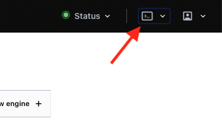

## Personlig service account og secret manager hemmelighet for bruker/team
For å enklere styre tilgang oppretter vi en unik service account og en secret manager hemmelighet for hver ulike bruker/gruppe som legges til i knada-gcp prosjektet. Disse blir opprettet når man tar kontakt med oss i (1) [her](#server-med-tilgang-til-on-prem).

Du vil finne igjen service accounten [her](https://console.cloud.google.com/iam-admin/serviceaccounts?project=knada-gcp) og hemmeligheten [her](https://console.cloud.google.com/security/secret-manager?project=knada-gcp).

### Hemmeligheter for on-prem Postgres

Hvis du har behov for å snakke med Postgres on-prem må du enten opprette en statisk (5000 timer) brukernavn, heller hente nytt passord hver 24 time.
For å kunne hente statiske brukere må du gjøre endring på database-oppsettet, ta en titt på [database-iac/doc](https://github.com/navikt/database-iac#static-credentials) for hvordan dette gjøres.

Uavhengig om hvilken type bruker du trenger må du følge dokumentasjonen til [vault-iac/postgres](https://github.com/navikt/vault-iac/blob/master/doc/databases/postgres.md#developer-access) for å hente ut brukernavn og passord.

Begge deler kan gjøres via [Vault CLI](https://www.vaultproject.io/docs/commands) lokalt eller via [Vault Browser terminal](https://vault.adeo.no) (se bilde for hvor du finner knappen).



Når du har hentet ut hemmeligheten fra Vault må du legge det inn i Google Secret manager som beskrevet [ovenfor](#credentials-og-hemmeligheter).

## Bruk av hostnavn på onprem-tjenester
I dette prosjektet støtter vi ikke navneoppslag mot on-premises.
Det betyr at databasenavn må oversettes til ip-adresser i Notebooks.
Man kan finne ip-adressen til en database ved å pinge hostnavnet fra f.eks. utviklerimage:
```
$ ping dm08db01.adeo.no
> PING dm08db01.adeo.no (10.x.x.x): 56 data bytes
```

Vi har også lagd en liste over de åpningen vi har (og ip-adressene) over i [navikt/pig/nada](https://github.com/navikt/pig/blob/master/nada/doc/knada-gcp.md#brannmur%C3%A5pninger).

For å bruke IP i stedet for en vanlig adresse så er det bare å bytte direkte.
Så hvis følgende er den "vanlige" kode-snutten din:
```python
dsnStr = cx_Oracle.makedsn('dm08db01.adeo.no','1521',service_name='DWH_HA')
```

så kan du heller skrive
```python
dsnStr = cx_Oracle.makedsn('10.x.x.x','1521',service_name='DWH_HA')
```

## Oppsett for Oracle- og Postgres-drivere
For å gjøre det enkelt for dere å komme i gang, har vi lagd to scripts som begge må kjøres med root privilegier.

Kjør først kommandoen:
```bash
sudo -i
```
for å kunne kjøre skriptene som root.

Trenger du Oracle lim inn følgende i terminalen din:
```bash

apt-get update && apt-get install -yq --no-install-recommends \
    build-essential \
    curl \
    alien \
    libaio1 \
    libaio-dev && \
    apt-get clean && \
    rm -rf /var/lib/apt/lists/*

curl https://download.oracle.com/otn_software/linux/instantclient/215000/oracle-instantclient-basic-21.5.0.0.0-1.x86_64.rpm > /tmp/oracle-instantclient-basic-21.5.0.0.0-1.x86_64.rpm

alien -i /tmp/oracle-instantclient-basic-21.5.0.0.0-1.x86_64.rpm && \
    rm -rf /var/cache/yum && \
    rm -f /tmp/oracle-instantclient-basic-21.5.0.0.0-1.x86_64.rpm && \
    echo "/usr/lib/oracle/21.5/client64/lib" > /etc/ld.so.conf.d/oracle-instantclient21.5.conf && \
    /usr/sbin/ldconfig

PATH=$PATH:/usr/lib/oracle/21.5/client64/bin
```

Trenger du Postgres, lim inn følgende i terminalen din:
```bash
apt-get update && apt-get install -yq --no-install-recommends libpq-dev
```

### Tilpasse connector for raskere spørringer
Ved å justere `arraysize` og `prefetchrows` kan spørringer fra databaser on-prem forbedres markant.
Se for eksempel dokumentasjonen av [cx_Oracle-biblioteket](https://cx-oracle.readthedocs.io/en/latest/user_guide/tuning.html#tuningfetch).
