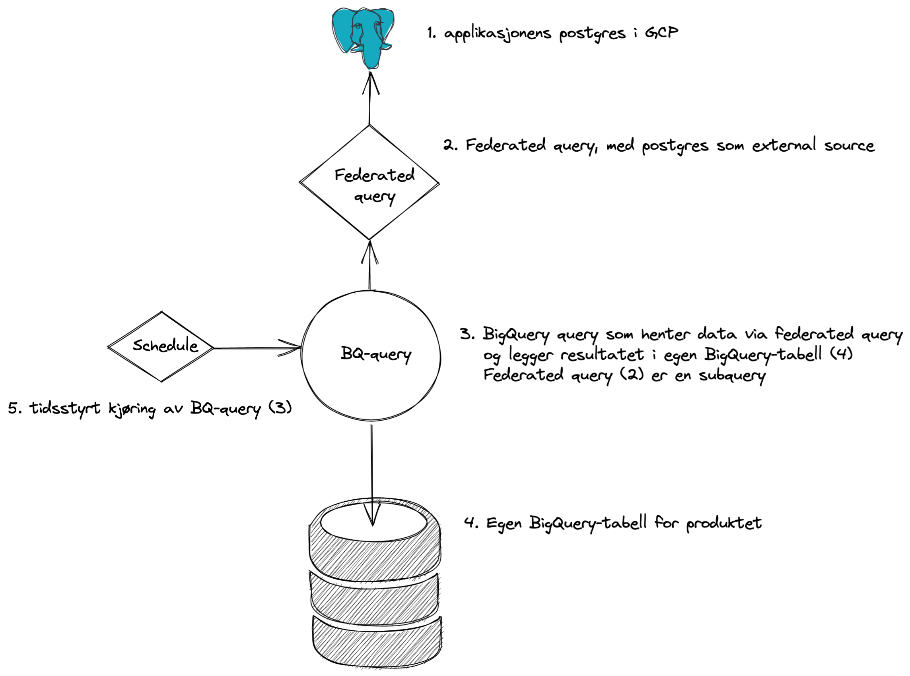
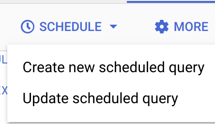

# Bruk av federated queries og automatiske spørringer




## Lag en ny PostgreSQL bruker og gi den tilgang til databasen
Følg instruksjonene i [NAIS-dokumentasjonen](https://docs.nais.io/persistence/postgres/#personal-database-access) for å koble til databasen
Når du er inne i databasen, oppretter du og gir tilgang til databasebrukeren med kommandoene nedenfor.
```sql
CREATE USER <brukernavn> WITH ENCRYPTED PASSWORD '<passord>';
GRANT CONNECT ON DATABASE <databasenavn> TO "<brukernavn>";
GRANT USAGE ON SCHEMA public TO <brukernavn>;
```
Videre kan du gi brukeren rettigheter til å lese alle tabeller:
```sql
GRANT SELECT ON ALL TABLES IN SCHEMA public TO <brukernavn>;
```
eller utvalgte tabeller:
```sql
GRANT SELECT ON <tabellnavn> TO <brukernavn>;
```

## Sett opp external connection
Følg [Google sin guide](https://cloud.google.com/bigquery/docs/cloud-sql-federated-queries#setting-up-cloud-sql-database-connections) til hvordan legge til en Cloud SQL databasekobling.

## Opprett eget datasett for dataproduktet
Følg [Google sin guide](https://cloud.google.com/bigquery/docs/datasets)
Foreløpig kan vi ikke gjenbruke datasett som har blitt opprettet av en nais-applikasjon, da denne overstyrer tilgangene vi oppretter senere i denne guiden.

## Lag en Google serviceaccount for federated query
Følg [Google sin guide](https://cloud.google.com/iam/docs/creating-managing-service-accounts)
Gi serviceaccounten følgende tilganger på prosjektnivå:

- BigQuery Connection User
- BigQuery Job User
- BigQuery Metadata Viewer

## Gi tilganger til serviceaccount på dataset
Følg [Google sin guide](https://cloud.google.com/bigquery/docs/dataset-access-controls)
Serviceaccounten trenger rollen "BigQuery Data Editor"

## Sett opp spørringen som henter data via external connection
Ved å f.eks. bruke [Google Cloud Console](https://console.cloud.google.com) kan vi lage en ny spørring.
Velg riktig prosjekt, gå inn på BigQuery og klikk "Compose New Query" til høyre.

Eksempelspørring:
```sql
SELECT * FROM EXTERNAL_QUERY(
'europe-north1.<connection_name>',
'''

-- Lag en variabel for varsjonering 
WITH constants (version) as (
values (now())
)

-- Legg inn rader fra Postgres-tabellen med et felt for version-variablen vi definerte over.
SELECT id::text, name, "group", pii, created, last_modified, "type"::text, version
FROM dataproducts,constants
''');
```

## Kjør spørring på tidsintervall
For å kjøre spørringen på intervall, så kan du i Query Explorer i Cloud Console velge å definere en "Schedule".

Klikk "Schedule" og "Create new schedule"



```
name: et passende navn 
repeats: Det som passer produktet
dataset name: datasettet som ble laget tidligere i guiden
table name: navn på produkt-tabell
advanced options:
- service account: service account som ble laget tidligere i guiden
```
